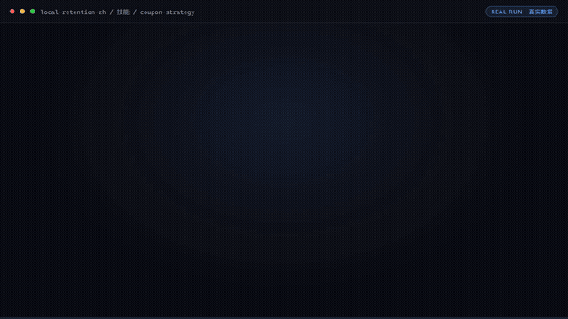

# 复购管家

> **让 80% 沉睡私域重新到店的"AI 店长助理"**



*▲ 实时演示（自动循环）· [▶ 观看完整版合集视频](docs/demo.mp4)*

*上方演示视频由 5 个代表资产的真实执行截图串联（优惠券策略测算 / 入群欢迎与打标 / 每日朋友圈文案 / 沉睡客户唤醒 / 社群活动 SOP），每张 4 秒，全部来自脚本实跑与 AI 实跑产物。*

[](https://github.com/bangwozuo)
[](#资产矩阵)
[](#资产形态)
[](LICENSE)

---

## 数字员工总览

| 字段 | 内容 |
|------|------|
| 名称 / 定位 | **复购管家** —— 让 80% 沉睡私域重新到店的"AI 店长助理" |
| 目标客群 | 本地生活商家：已沉淀微信私域但不会运营的门店（68% 运营能力断层，据 R4 调研） |
| 做什么 | 入群欢迎与打标、朋友圈/社群内容日更、优惠券测算与触达、沉睡客户唤醒、到店核销引导 |
| 不做什么 | 不自动加好友、不群发轰炸（防封号红线）、不承诺转化率、不碰非官方自动化工具 |
| KPI | 私域内容日更率 100%；沉睡客户唤醒到店率 ≥5%；社群月均活动 ≥4 次 |
| 旧名存档 | `私域复购管家` |

---

## 资产矩阵（5 技能 + 5 工作流）

| 资产 | 一句话 | 类型 | README |
|------|--------|------|--------|
| [企微客户对接](skills/wecom-customer-sync/README.md) | 企微客户/群数据按 SOP 安全读写，双通道（官方 API / 人工导出降级），写操作全部人工确认 | 技能 · T4 连接器 | [README](skills/wecom-customer-sync/README.md) |
| [朋友圈文案生成](skills/moments-copy-generate/README.md) | 门店素材写成"像店主本人发的"朋友圈：五关写作规则 + 极限词自查，≤140 字防折叠 | 技能 · T2 提示词 | [README](skills/moments-copy-generate/README.md) |
| [社群 SOP 模板库](skills/community-sop-library/README.md) | 6 项健康度基线诊断 + 3 类行业周节奏模板，按天拆到动作、每条带量化验收 | 技能 · T2 提示词 | [README](skills/community-sop-library/README.md) |
| [优惠券策略](skills/coupon-strategy/README.md) | 安全面额 = 单均毛利 × 30%，ROI ≥ 1.5 才执行；脚本一次测算产出 Excel + ROI 图 | 技能 · T1 脚本 | [README](skills/coupon-strategy/README.md) |
| [封号合规风控](skills/account-ban-risk-control/README.md) | 触达动作执行前的安检门：频次/内容/行为/工具四维审查，对抗性工具一律拦截 | 技能 · T2 提示词 | [README](skills/account-ban-risk-control/README.md) |
| [入群欢迎与打标](workflows/group-welcome-tag-flow/README.md) | 扫码入群 5 分钟内 @欢迎、6 类来源自动打标、72h 首单转化排期，迎新期触达 ≤ 2 次 | 工作流 · T3 脚本 | [README](workflows/group-welcome-tag-flow/README.md) |
| [每日朋友圈文案](workflows/daily-moments-copy-flow/README.md) | 每日 7:30 推送 3 条候选：配比核算 + 骨架填槽 + 极限词/诱导分享风控拦截 | 工作流 · T3 脚本 | [README](workflows/daily-moments-copy-flow/README.md) |
| [社群活动 SOP](workflows/community-activity-sop-flow/README.md) | 每周一推送：群健康度诊断（沉默/劣化先治）→ 行业×目标活动模板 → 带验收的周排期 | 工作流 · T3 脚本 | [README](workflows/community-activity-sop-flow/README.md) |
| [沉睡客户唤醒](workflows/dormant-customer-wake-flow/README.md) | 每周扫描 30/60/90 天未互动客户，逐人配安全面额券与触达节奏（7 天 ≤ 2 次） | 工作流 · T3 脚本 | [README](workflows/dormant-customer-wake-flow/README.md) |
| [到店核销引导](workflows/instore-redemption-guide-flow/README.md) | 券到期前 3 天内按 D-3/D-1/当天三档提醒，一券只提醒一次，全部挂券码归因 | 工作流 · T3 脚本 | [README](workflows/instore-redemption-guide-flow/README.md) |

---

## 资产形态

**提示词为主 + 确定性脚本为辅**：

| 特性 | 说明 |
|------|------|
| ✅ 无需 API Key | 一个 Key 都不需要 |
| ✅ 提示词资产 | 4 个技能即拷即用，粘贴到任何 AI 工具 |
| ✅ 脚本资产 | 优惠券测算 + 5 条工作流带 `scripts/`，`--demo` 即可真实跑通，产物落盘 Excel/PNG/JSON |
| ✅ 平台无关 | Coze / WorkBuddy / Dify / Claude / ChatGPT 均可 |
| ✅ 用户自备算力 | 模型来自你自己的订阅 |

---

## 快速开始

```text
1. 打开 skills/wecom-customer-sync/prompt.txt
2. 全文复制
3. 粘贴到你常用的 AI 工具（Coze / WorkBuddy / Dify / Claude / ChatGPT）
4. 按 SKILL.md 的输入规格提供数据
```

脚本类资产一条命令跑通（无需密钥）：

```bash
python skills/coupon-strategy/scripts/coupon_calc.py --demo
python workflows/group-welcome-tag-flow/scripts/run_flow.py --demo
```

完整指引见 [使用手册](docs/04-usage.md)。

---

## 仓库结构

```text
local-retention-zh/
├── README.md / employee.md / package.yaml     # 入口与 12 字段定义卡
├── docs/demo.mp4                              # 5 资产真实执行演示视频
├── docs/01~07                                 # 员工级文档（架构/流程/场景/手册/示例/录像/测试）
├── skills/                                    # 5 个原子技能
│   └── <skill>/
│       ├── README.md  SKILL.md  prompt.txt  schema.json  examples/
│       ├── scripts/                           # 优惠券策略带测算脚本
│       └── docs/                              # 该技能自己的 10 项文档 + 截图
├── workflows/                                 # 5 条工作流（复合技能）
│   └── <workflow>/
│       ├── README.md  SKILL.md  prompt.txt  schema.json  examples/
│       ├── scripts/run_flow.py                # 端到端编排脚本（--demo 真实跑通）
│       └── docs/                              # 该工作流自己的 10 项文档 + 截图
├── knowledge/                                 # RAG wiki 知识库
├── connectors/                                # 连接器说明 + 合规红线
├── quality/                                   # 效果基线与追踪日志
└── tests/                                     # 资产校验测试（离线，无需密钥）
```

### 每个技能 / 工作流自带的 docs

| 文档 | 内容 |
|------|------|
| `README.md` | 资产速览（真实执行截图 + 能力规则表 + 流水线图） |
| `docs/01-usage-manual.md` | 安装使用手册 |
| `docs/02-architecture.md` | 业务架构图 |
| `docs/03-flow.md` | 流程图（Mermaid + 配图） |
| `docs/04-examples.md` | 使用示例 |
| `docs/05-media.md` | 截图和录屏（清单 + 分镜脚本） |
| `docs/06-scenarios.md` | 使用场景（适用 / 不适用） |
| `docs/07-audience.md` | 用户群体 |
| `docs/08-value.md` | 解决问题与价值 |
| `docs/09-test-report.md` | 测试报告 |
| `docs/assets/run-terminal.png` | 真实执行 / 实跑产物终端截图 |

---

## 交付物导航

| 文档 | 内容 |
|------|------|
| [业务架构](docs/01-architecture.md) | 四层架构 + 数据流 + 能力边界 |
| [工作流流程](docs/02-workflow.md) | 5 条工作流的 DAG 可视化 |
| [使用场景](docs/03-scenarios.md) | 3 个真实场景（含前后对比） |
| [使用手册](docs/04-usage.md) | 各平台导入指引 + 常见问题 |
| [示例库](docs/05-examples.md) | 5 组输入输出示例 |
| [录像脚本](docs/06-recording-script.md) | 7 镜头分镜 + 旁白稿 |
| [校验报告](docs/07-test-report.md) | 资产质量校验结果 |

---

## 知识库与连接器

| 目录 | 说明 |
|------|------|
| [`knowledge/`](knowledge/README.md) | RAG wiki 知识库：填入业务信息可显著提升输出质量 |
| [`connectors/`](connectors/README.md) | 连接器说明：数据从哪来、怎么合规地来 |

---

## 资产校验

```bash
pip install -r requirements.txt
pytest tests/ -v
```

校验技能完整性、提示词结构、契约一致性、工作流 DAG、技能级与工作流级 docs 完整性、知识库 wiki 与连接器结构。
**不需要任何 API Key。**

---

## 合规声明

- ✅ 所有输出为 **AI 辅助生成**，交付前须人工审核
- ✅ 提示词内置**违禁词禁止清单**，符合《广告法》要求
- ✅ 遵循《人工智能生成合成内容标识办法》
- ✅ 连接器只走**官方 API** 或**用户导出数据**
- ✅ 所有对外发布动作**保留人工确认环节**

---

## 许可

[Apache-2.0](LICENSE) — 可自由使用、修改、商用

---

*由 bangwozuo 业务库自动生成 · 2026-09-29*

*本仓库遵循 [bangwozuo 数字员工资产规范](https://github.com/bangwozuo/digital-employee-spec) v3.0 ｜ [总入口](https://github.com/bangwozuo/digital-employees-hub-zh)*
