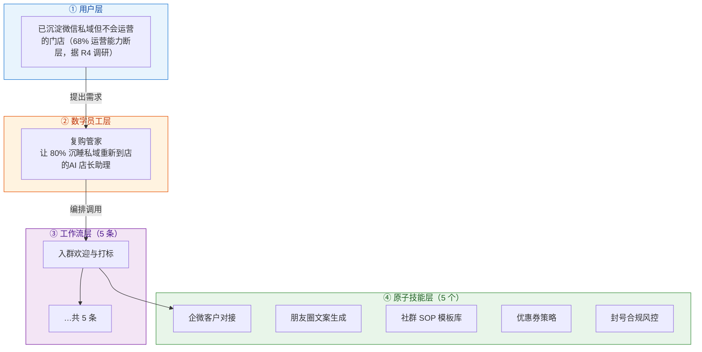
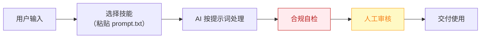

# 复购管家 — 业务架构

## 四层视图

## 资产形态说明

本资产包为**纯提示词客户端资产**：

| 特性 | 说明 |
|------|------|
| 无运行时依赖 | 不调用任何模型 API，不需要 API Key |
| 平台无关 | 提示词为纯文本，可导入任意主流 AI 平台 |
| 用户自备算力 | 模型由用户自己的订阅提供 |
| 零服务端成本 | 资产方不产生任何调用费用 |

## 数据流

> **关键设计**：所有对外输出必须经过「合规自检 → 人工审核」双闸门。

## 能力边界

| 维度 | 内容 |
|------|------|
| **目标用户** | 已沉淀微信私域但不会运营的门店（68% 运营能力断层，据 R4 调研） |
| **做** | **做**：入群欢迎、标签分层建议、朋友圈/社群内容日更、优惠券触达文案；** |
| **不做** | 不做**：不自动加好友、不群发轰炸（防封号红线）、不承诺转化率 |
| **KPI** | 私域内容日更率 100%；沉睡客户唤醒到店率 ≥5%；社群月均活动 ≥4 次 |
| **定价** | 100–300 元/月（SCRM 入门版 3980 元/年已被市场验证，据 R4 调研）；**代配置服务加成：500–1000 元/次**（企微开通代办+历史客户导入打标+首月内容陪跑——这是本群体数字化门槛最高的环节，代配置几乎是必选项） |

---

*本图由 build_p0_assets.py 自动生成*
