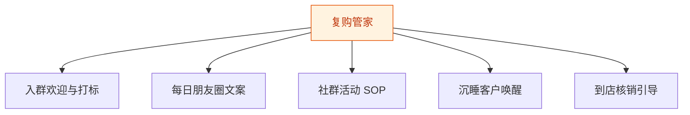
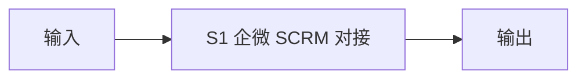
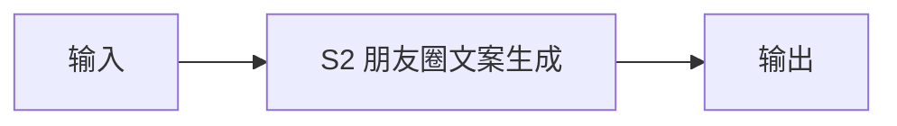
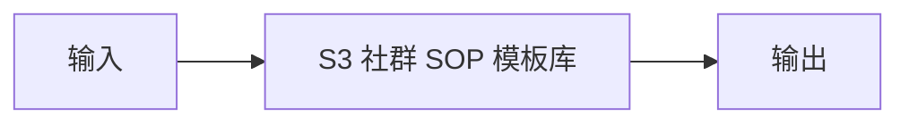
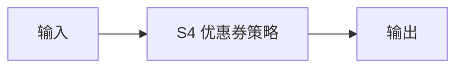
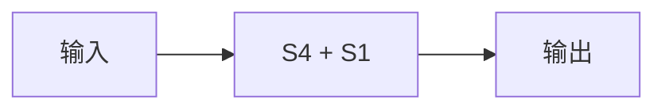

# 复购管家 — 工作流流程图

本员工共 **5 条工作流**，下辖 **5 个原子技能**。

## 总览

## 分条详情

### 入群欢迎与打标

| 项目 | 内容 |
|------|------|
| 触发 | 事件（客户扫码入群） |
| 复杂度 | `M` |
| 阶段 | `P0` |
| ROI | 替代人工登记，单客省 3 分钟 |

### 每日朋友圈文案

| 项目 | 内容 |
|------|------|
| 触发 | 定时（每日 7:30 推送 3 条候选） |
| 复杂度 | `S` |
| 阶段 | `P0` |
| ROI | 解决"每天发什么"枯竭痛点，月省 10 小时+ |

### 社群活动 SOP

| 项目 | 内容 |
|------|------|
| 触发 | 定时（每周一推送本周 SOP） |
| 复杂度 | `S` |
| 阶段 | `P0` |
| ROI | 替代代运营社群服务（2000 元/月档） |

### 沉睡客户唤醒

| 项目 | 内容 |
|------|------|
| 触发 | 定时（每周扫描） |
| 复杂度 | `M` |
| 阶段 | `P1` |
| ROI | 唤醒 5% 沉睡客户 ≈ 月增数千元营收 |

### 到店核销引导

| 项目 | 内容 |
|------|------|
| 触发 | 事件（领券后 48h 未到店） |
| 复杂度 | `M` |
| 阶段 | `P1` |
| ROI | 提升券核销率，直接换算营收 |

## 汇总表

| # | 工作流 | 阶段 | 复杂度 | 触发 | 涉及技能数 |
|---|--------|------|--------|------|-----------|
| 1 | 入群欢迎与打标 | `P0` | `M` | 事件（客户扫码入群） | 1 |
| 2 | 每日朋友圈文案 | `P0` | `S` | 定时（每日 7:30 推送 3 条候选） | 1 |
| 3 | 社群活动 SOP | `P0` | `S` | 定时（每周一推送本周 SOP） | 1 |
| 4 | 沉睡客户唤醒 | `P1` | `M` | 定时（每周扫描） | 1 |
| 5 | 到店核销引导 | `P1` | `M` | 事件（领券后 48h 未到店） | 1 |

---

*本图由 build_p0_assets.py 自动生成*
