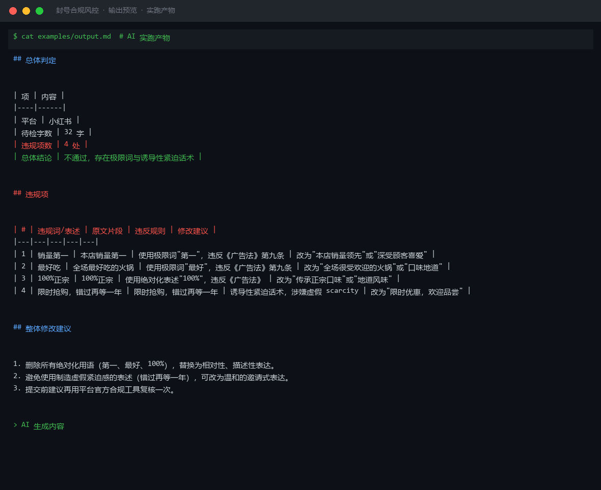
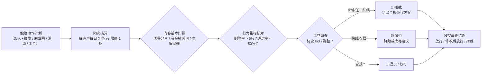

# 封号合规风控 Account Ban Risk Control

> 原子技能 ｜ 属于「复购管家」 ｜ 本地生活商家客群 ｜ T2 提示词型（纯提示词，无脚本）
>
> **私域触达动作执行前的一道"安检门"：把会导致限权、封禁、客户投诉的操作拦下来，并给出合规替代方案。**
> 四维审查体系（频次/内容/行为/工具）· 5 条频次红线阈值全量化 · 三级判定（🔴拦截/🟡缓行/🔵提示）· 对抗性工具一律无变通拦截



🎬 **[▶ 观看演示视频（在线播放）](https://cdn.jsdelivr.net/gh/bangwozuo/local-retention-zh@main/skills/account-ban-risk-control/docs/assets/demo.mp4) · [GitHub 页](https://github.com/bangwozuo/local-retention-zh/blob/main/skills/account-ban-risk-control/docs/assets/demo.mp4)** — 四幕创作叙事：业务钩子 → 真实执行 → 要点到成稿演变 → 交付物

*上图来自实跑产物：32 字待检文案命中 4 处违规（2 处《广告法》极限词 + 1 处绝对化表述 + 1 处虚假紧迫话术），判定「不通过」，每条给出可直接替换的写法。*

---

## 它审什么（四个维度，逐条对照）

### 一、频次类（最常见封号原因）

| 行为 | 红线阈值 | 触发后果 |
|---|---|---|
| 个人号主动加好友 | ≤ 20-30 人/天，通过率 < 50% 立即停手 | 加人功能限权 24h-7 天 |
| 新注册号加人 | 注册后养号 7-14 天 | 新号直接营销 = 高概率封号 |
| 群发消息 | 同一客户 ≤ 1 条/天；营销群发每周 ≤ 2 次 | 客户投诉 → 限权 → 封号 |
| 朋友圈发布 | 营销内容 ≤ 3 条/天，与生活内容穿插 | 被拉黑率升高 → 连带风控 |
| 企微群发助手 | 每客户每周 1 条，与 1v1 触达错开 | 发送失败/账号降权 |

### 二、内容类（话术红线）

- **诱导分享**：「转发到 2 个群才能领」「集赞领取」——违反微信外部内容规范，明文红线
- **涉资金敏感词**：「转账」「返现」「加V」「私下交易」——个人号极易触发支付风控
- **虚假紧迫**：「最后 3 个名额」但库存真实充足——举报一次进观察名单
- **跨号导流**：「这个号不常看，加我小号」——判定小号矩阵，连坐封禁

### 三、行为类（客户负反馈考核）

| 指标 | 阈值 | 含义 |
|---|---|---|
| 删除率 | 单次群发后 > 5% | 降权信号 |
| 投诉率 | 「骚扰」举报累计 2-3 次 | 封禁 |
| 通过率 | 申请后 30 分钟内 < 50% | 来源场景不合格，继续加只会恶化 |

### 四、工具类（绝对红线，无替代方案）

- ❌ 协议机器人 / 群控 / 模拟器多开——设备指纹直接识别，封号率极高且不可申诉
- ❌ 自动抢红包、虚拟定位打卡、批量注册接码
- ✅ 唯一安全路径：企微官方 API + 官方群发频控内的人工操作

## 三级判定

| 级别 | 含义 | 处理 |
|---|---|---|
| 🔴 拦截 | 触发红线（工具类/诱导分享/超频次） | 必须改，给出合规替代 |
| 🟡 缓行 | 频次贴线、话术易被投诉 | 给出降频或改写建议 |
| 🔵 提示 | 合规但有更优做法 | 说明优化方向 |

**工作铁律**：先审计划再审话术——频次超标时话术写得再好也要拦；不协助规避检测（不给「养小号池」「错峰批量加人」这类对抗方案）；不确定时标 🟡 并说明理由，不扩大打击面。

## 真实输入 → 真实输出

**输入**（`examples/input.json`）：待审的门店推广文案与发布信息。

**输出**（AI 实跑，32 字命中 4 处，节选）：

| # | 违规词/表述 | 原文片段 | 违反规则 | 修改建议 |
|---|---|---|---|---|
| 1 | 销量第一 | 本店销量第一 | 极限词"第一"，违反《广告法》第九条 | 改为"本店销量领先"或"深受顾客喜爱" |
| 2 | 最好吃 | 全场最好吃的火锅 | 极限词"最好"，违反《广告法》第九条 | 改为"口味地道" |
| 3 | 100%正宗 | 100%正宗 | 绝对化表述"100%" | 改为"传承正宗口味" |
| 4 | 错过再等一年 | 限时抢购，错过再等一年 | 诱导性虚假紧迫话术 | 改为"限时优惠，欢迎品尝" |

完整 4 条见 [`examples/output.md`](examples/output.md)。

## 处理流水线



## 快速开始

```text
1. 打开 prompt.txt，全文复制
2. 粘贴到 Coze / WorkBuddy / Dify / Claude / ChatGPT
3. 按 schema.json 的输入规格提供：待审的触达动作计划 + 账号状态（新号/老号/有记录号）
```

## 面向谁 / 什么时候用

| ✅ 该用 | ❌ 别用 |
|---|---|
| 加人计划、群发、社群活动执行前的最后安检 | 替代平台官方审核（规则以微信/企微官方公告为准） |
| 选型第三方"自动化营销工具"前的红线排查 | 协助规避风控（换设备、养小号池一律不给方案） |
| 新号养号期规划与账号健康诊断 | 产出营销内容本身（本技能只做放行/拦截判断） |

## 边界与合规

- 本资产输出为 **AI 辅助生成内容**，风控判断为辅助参考，不能替代平台官方审核结果
- 平台规则持续更新，执行前对照微信/企业微信官方最新公告二次确认
- 涉及客户个人信息的操作须遵守《个人信息保护法》：收集偏好前告知用途，客户要求删除时配合删除

## 文件地图

```text
├── README.md            ← 本文件
├── SKILL.md             ← 资产定义（元信息 / 契约 / 边界）
├── prompt.txt           ← 提示词本体（四维规则表 + 三级判定 + 输出格式）
├── schema.json          ← 输入输出契约（机器可读）
├── examples/            ← 真实输入 + AI 实跑输出
└── docs/                ← 9 项配套文档（架构 / 流程 / 场景 / 测试报告…）
```

---

*本资产遵循 [bangwozuo 数字员工资产规范](https://github.com/bangwozuo/digital-employee-spec) v3.0 ｜ [所属员工：复购管家](../../) ｜ [总入口](https://github.com/bangwozuo/digital-employees-hub-zh)*
