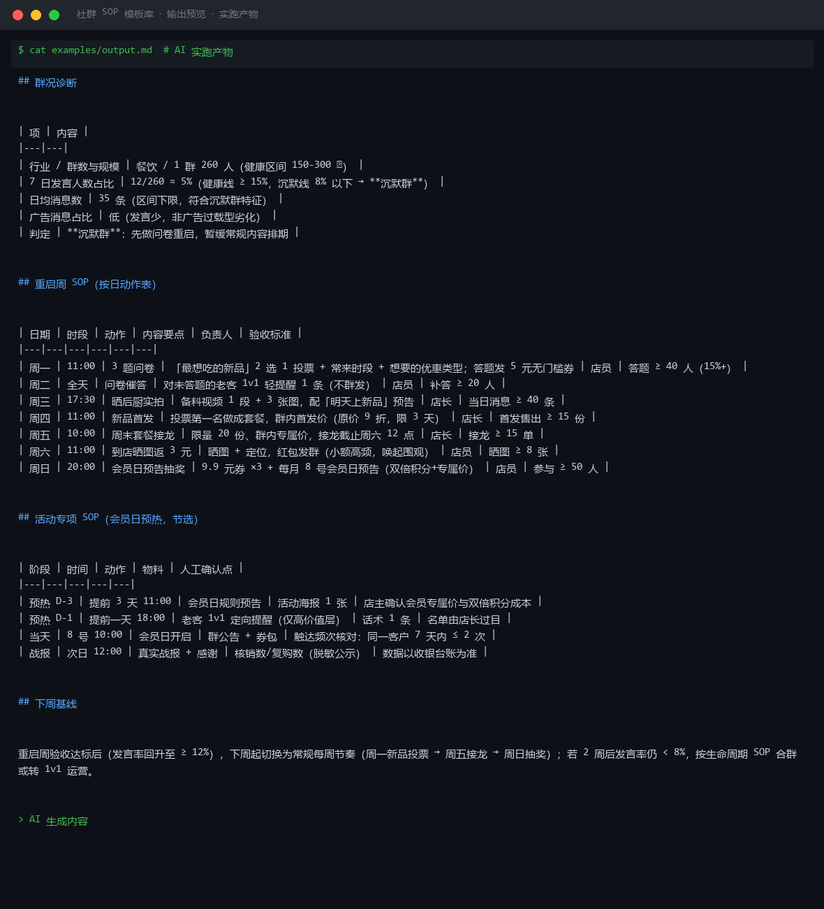
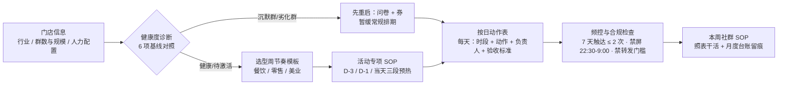

# 社群 SOP 模板库 Community SOP Library

> 原子技能 ｜ 属于「复购管家」 ｜ 本地生活商家客群 ｜ T2 提示词型（纯提示词，无脚本）
>
> **按门店行业、群规模、人力配置，输出一份"按天拆到动作"的社群运营 SOP——每一天发什么、几点发、谁执行、怎么验收，照着表就能干活。**
> 6 项健康度基线全量化 · 3 类行业周节奏模板（餐饮/零售/美业）· 生命周期 4 阶段 SOP · 每条动作必带量化验收标准



🎬 **[▶ 观看演示视频](docs/assets/demo.mp4)** — 四幕创作叙事：业务钩子 → 真实执行 → 要点到成稿演变 → 交付物

*上图来自实跑产物：260 人群发言率仅 5%（健康线 ≥ 15%）被判定「沉默群」，先给 7 天问卷重启 SOP（每天动作 + 验收标准），暂缓常规内容排期。*

---

## 它做什么（先诊断，再开方）

### 健康度基线（6 项指标，缺哪补哪）

| 指标 | 健康线 | 诊断动作 |
|---|---|---|
| 群规模 | 150-300 人 | 超 400 人发言率骤降，建议拆群分层 |
| 7 日发言人数占比 | ≥ 15% | 低于 8% 属沉默群，先唤醒再排日常 SOP |
| 日均消息数 | 30-150 条 | > 300 条须设群规 + 禁屏时段 |
| 广告消息占比 | ≤ 30% | 超 50% 两周内必死群 |
| 入群 72h 内首单转化 | ≥ 20% | 低于 10% 查欢迎语与首单钩子 |
| 月退群率 | ≤ 5% | 高于 10% 查触达频率与内容质量 |

### 每周节奏模板（按行业选型）

| 行业 | 一周骨架 | 核心钩子 |
|---|---|---|
| 餐饮 | 周一菜单投票（≥30 人）→ 周三晒后厨（消息 ≥40）→ 周五接龙（≥15 单）→ 周六晒图返 3 元 → 周日抽奖（≥50 人） | 限量 + 群内专属价 |
| 零售 | 周一上新清单 → 周三临期秒杀（晚 8 点 30 份）→ 周四食谱内容 → 周五配送接龙 → 周日积分翻倍 | 限时限量，群内低价 SKU ≤ 3 个保毛利 |
| 美业 | 周二作品日（5-8 张）→ 周三知识日 → 周四空位闪订（5 折限 2 个）→ 周六返图日 | 空位闪订：闲置时段变群特权 |

### 生命周期四阶段 SOP

1. **冷启动期（0-30 天）**：到店客户面对面拉入，目标 80-150 人；前 2 周不发硬广
2. **日常运营期（30 天+）**：按周节奏模板执行，客户消息 30 分钟内响应
3. **活动期**：预热 D-3/D-1/当天共 3 次触达，同一客户 7 天内活动触达 ≤ 2 次
4. **沉寂/劣化处理**：发言率 < 8% 连续 2 周 → 3 题问卷 + 5 元券重启；4 周无改善 → 合群或转 1v1

## 真实输入 → 真实输出

**输入**（`examples/input.json`）：行业 + 群现状（人数/发言/广告占比）+ 本周目标。

**输出**（AI 实跑，节选）：

| 日期 | 时段 | 动作 | 验收标准 |
|---|---|---|---|
| 周一 | 11:00 | 3 题问卷（答题发 5 元无门槛券） | 答题 ≥ 40 人（15%+） |
| 周三 | 17:30 | 晒后厨实拍 + 新品预告 | 当日消息 ≥ 40 条 |
| 周四 | 11:00 | 新品首发（投票第一名做套餐，9 折限 3 天） | 首发售出 ≥ 15 份 |
| 周五 | 10:00 | 周末套餐接龙（限量 20 份群内专属价） | 接龙 ≥ 15 单 |
| 周日 | 20:00 | 会员日预告抽奖（9.9 元券 ×3） | 参与 ≥ 50 人 |

完整 SOP（含活动专项 D-3/D-1/当天触达表）见 [`examples/output.md`](examples/output.md)。

## 处理流水线



## 快速开始

```text
1. 打开 prompt.txt，全文复制
2. 粘贴到 Coze / WorkBuddy / Dify / Claude / ChatGPT
3. 按 schema.json 的输入规格提供：行业 + 群现状（人数/发言率/广告占比）+ 本周目标
```

## 面向谁 / 什么时候用

| ✅ 该用 | ❌ 别用 |
|---|---|
| 新群冷启动规划 / 沉默群重启 | 无群或群成员 < 50 人的起步期（先攒种子用户） |
| 每周一出本周 SOP，照表执行 | 替代店主决策（活动价格与机制须店主确认） |
| 会员日 / 清库存等专项活动排期 | 承诺社群转化率（只给基线区间，不给保证） |

## 边界与合规

- 本资产输出为 **AI 辅助生成内容**，SOP 为运营建议，价格与活动机制执行前经店主确认
- 社群内发放的券与红包涉及资金，台账须可对账；中奖名单公示须脱敏（昵称+尾号）
- 触达频次遵守微信平台规则，以官方最新公告为准；群内负面内容按投诉流程处理，禁删评

## 文件地图

```text
├── README.md            ← 本文件
├── SKILL.md             ← 资产定义（元信息 / 契约 / 边界）
├── prompt.txt           ← 提示词本体（基线表 + 行业模板 + 生命周期 SOP）
├── schema.json          ← 输入输出契约（机器可读）
├── examples/            ← 真实输入 + AI 实跑输出
└── docs/                ← 9 项配套文档（架构 / 流程 / 场景 / 测试报告…）
```

---

*本资产遵循 [bangwozuo 数字员工资产规范](https://github.com/bangwozuo/digital-employee-spec) v3.0 ｜ [所属员工：复购管家](../../) ｜ [总入口](https://github.com/bangwozuo/digital-employees-hub-zh)*
