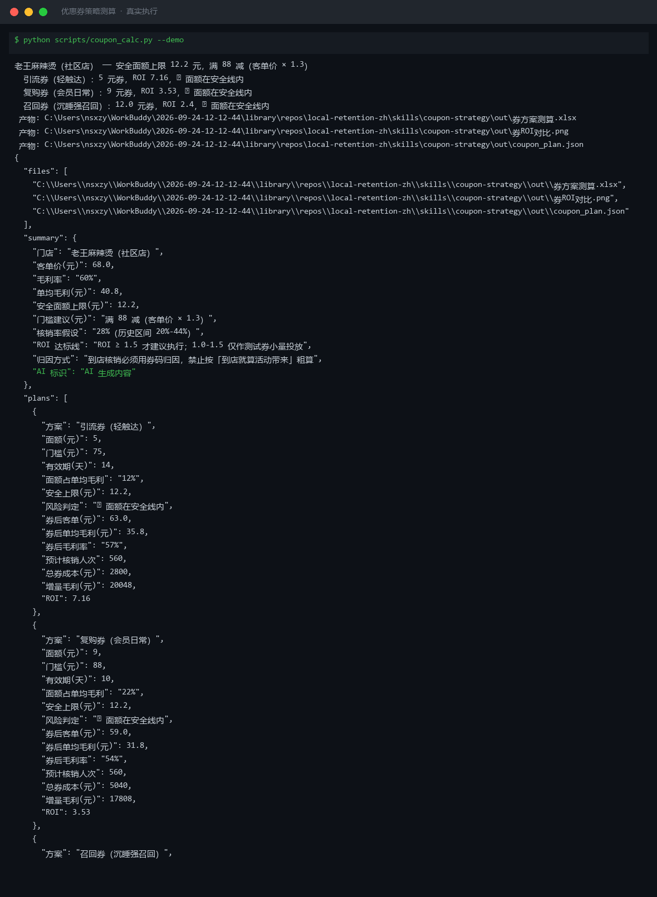
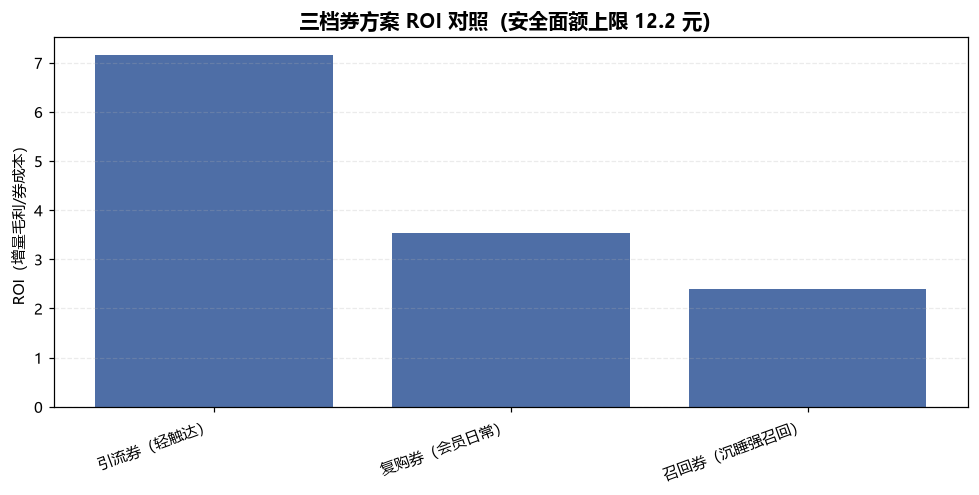
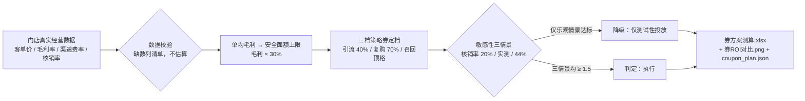

# 优惠券策略 Coupon Strategy

> 原子技能 ｜ 属于「复购管家」 ｜ 本地生活商家客群 ｜ T1 产物型（脚本交付真实文件）
>
> **把"该发一张什么面额、什么门槛、什么有效期的券"从拍脑袋变成可验算的数字题——每张券算清让利成本、增量毛利和 ROI，亏本的券一张都不许发。**
> 5 条测算公式全量化 · 安全面额 = 单均毛利 × 30% 超线即标红 · 核销率 20%-44% 三情景敏感性 · ROI ≥ 1.5 才建议执行 · 一次测算产出 Excel + ROI 图 + JSON



🎬 **[▶ 观看演示视频（在线播放）](https://cdn.jsdelivr.net/gh/bangwozuo/local-retention-zh@main/skills/coupon-strategy/docs/assets/demo.mp4) · [GitHub 页](https://github.com/bangwozuo/local-retention-zh/blob/main/skills/coupon-strategy/docs/assets/demo.mp4)** — 四幕数据叙事：业务钩子 → 真实执行 → 指标条形图生长 → 交付物

*上图来自真实执行：客单 68 元、毛利率 60% 的麻辣烫店，单均毛利 40.8 元 → 安全面额上限 12.2 元；三档券 ROI 实跑分别为 7.16 / 3.53 / 2.4，全部在安全线内，判定可执行。*

## 三档方案实跑结果（demo：老王麻辣烫）

| 方案 | 面额 | 门槛 | 有效期 | 面额占单均毛利 | ROI | 风险判定 |
|---|---|---|---|---|---|---|
| 引流券（轻触达） | 5 元 | 满 75 减 | 14 天 | 12% | **7.16** | ✅ 面额在安全线内 |
| 复购券（会员日常） | 9 元 | 满 88 减 | 10 天 | 22% | **3.53** | ✅ 面额在安全线内 |
| 召回券（沉睡强召回） | 12 元 | 满 102 减 | 7 天 | 29% | **2.4** | ✅ 顶格安全线内 |



*券 ROI 对照图（脚本实跑产物 `out/券ROI对比.png`）。*

---

## 它算什么（五条公式，全部量化）

| 公式 | 规则 | 说明 |
|---|---|---|
| 单均毛利 | 客单价 × 毛利率 − 渠道费 | 客单 68 × 60% = 40.8 元，是所有面额的天花板来源 |
| 安全面额上限 | 单均毛利 × **30%** | 超过这条线，核销一单亏一单（40.8 × 30% ≈ 12 元） |
| 券成本 | 面额 × 核销率 | 核销率用本店历史券码数据，经验区间 **20%-44%**，无数据按 28% 起测并标注假设 |
| 满减门槛 | 客单价 × **1.3**（区间 1.2-1.5） | 低于 1.2 给本就会来的人白让利；高于 1.5 拦人，核销率跌穿 20% |
| ROI | 核销人次 × 券后单均毛利 ÷ 总券成本 | **≥ 1.5 才执行；1.0-1.5 只做测试券；< 1 一律否决** |

**有效期经验**：到店券 7-14 天。超过 14 天核销率衰减明显，且「到期未核销」要计入流失统计。

### 敏感性分析（demo 实跑，复购券档）

| 情景 | 预计核销人次 | 总券成本 | 增量毛利 | ROI |
|---|---|---|---|---|
| 核销率 20%（悲观） | 400 | 3,600 | 12,720 | 3.53 |
| 核销率 28%（假设） | 560 | 5,040 | 17,808 | 3.53 |
| 核销率 44%（乐观） | 880 | 7,920 | 27,984 | 3.53 |

## 真实输入 → 真实输出

**输入**（`examples/input.json`）：客单价 / 毛利率 / 渠道费率 / 核销率 / 月发放量——必须来自门店真实经营数据，缺哪项列清单让用户补，**不填默认值、不估算**。

**输出**（脚本实跑，产物三件）：

| 产物 | 内容 |
|---|---|
| `out/券方案测算.xlsx` | 三档方案 / 敏感性分析 / 汇总三个 sheet，亏本风险自动标红 |
| `out/券ROI对比.png` | 三档方案 ROI 与安全上限对照图 |
| `out/coupon_plan.json` | 机器可读结果，供 dormant-customer-wake-flow 等工作流读取 |

## 处理流水线



## 快速开始

**方式一：脚本（零 AI 依赖，确定性测算）**

```bash
# 演示模式（内置真实样例）
python scripts/coupon_calc.py --demo
# 指定输入
python scripts/coupon_calc.py --input examples/input.json --outdir out
```

**方式二：提示词（策略选型与话术）**

```text
1. 打开 prompt.txt，全文复制
2. 粘贴到任意 AI 工具
3. 铁律：数值以脚本输出为准——对话中每个金额与百分比都要能在 coupon_plan.json 找到出处
```

## 面向谁 / 什么时候用

| ✅ 该用 | ❌ 别用 |
|---|---|
| 发券前算清安全面额与 ROI，防"卖一单亏一单" | 用同商圈传闻核销率当测算依据（只认本店券码数据） |
| 用户坚持"满 100 减 30"时摊数字谈判 | 把召回券发给全量客户（必须写明名单圈选口径） |
| 外卖 vs 私域两条渠道分开算两张券表 | 承诺唤醒率/效果（只能给测算区间） |

## 边界与合规

- 本资产输出为 **AI 生成内容**，金额与 ROI 为测算值，执行前须经店主人工确认
- 归因口径：到店核销必须用**券码**归因，禁止把活动期间所有到店都算成券带来的
- 券活动涉及价格促销，原价须真实有销售记录支撑；资金决策由店主做，本技能只出测算不替签

## 文件地图

```text
├── README.md                  ← 本文件
├── SKILL.md                   ← 资产定义（元信息 / 契约 / 边界）
├── prompt.txt                 ← 提示词本体（五条公式 + 三档券 + 工作方法）
├── schema.json                ← 输入输出契约（机器可读）
├── scripts/coupon_calc.py     ← 确定性测算脚本（5 公式 → Excel/PNG/JSON）
├── examples/                  ← 真实输入 + 脚本实跑输出
├── docs/                      ← 9 项配套文档（架构 / 流程 / 场景 / 测试报告…）
└── out/                       ← 实跑产物（券方案测算.xlsx / 券ROI对比.png / coupon_plan.json）
```

---

*本资产遵循 [bangwozuo 数字员工资产规范](https://github.com/bangwozuo/digital-employee-spec) v3.0 ｜ [所属员工：复购管家](../../) ｜ [总入口](https://github.com/bangwozuo/digital-employees-hub-zh)*
