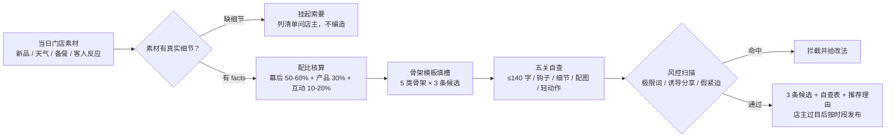

# 朋友圈文案生成 Moments Copy Generate

> 原子技能 ｜ 属于「复购管家」 ｜ 本地生活商家客群 ｜ T2 提示词型（纯提示词，无脚本）
>
> **把今天的门店素材写成"像店主本人发的"朋友圈——口语、有细节、不喊口号，让 300 个街坊客户记得这家店还活着、还好吃。**
> 五关写作规则（字数 ≤140 / 钩子 / 真实细节 / 配图 1-3-4-6 / 轻动作）· 5 类骨架模板 · 3 条硬性自查（极限词/诱导分享/AI 标识）· 无细节就索要，不编造


🎬 **[▶ 观看高清完整版（mp4）](https://cdn.jsdelivr.net/gh/bangwozuo/local-retention-zh@main/skills/moments-copy-generate/docs/assets/demo.mp4)** — 四幕创作叙事：业务钩子 → 真实执行 → 要点到成稿演变 → 交付物

*上图来自实跑产物：3 条候选文案（138 / 112 / 127 字，全部 ≤140 防折叠），极限词、诱导分享、假紧迫三项自查全部通过，并标注哪些细节需店主确认属实。*

---

## 它做什么（先看配比，再动笔）

### 内容配比与频控红线

| 内容类型 | 占比 | 例子 |
|---|---|---|
| 生活/幕后 | 50-60% | 备料实拍、进货、员工趣事、老板碎碎念 |
| 产品/促销 | 30% | 新品、今日推荐、临期/空位 specials |
| 互动/人设 | 10-20% | 提问、投票、翻牌客户返图 |

**频控**：营销 ≤ 3 条/天，总量 ≤ 5 条；21:30 后禁屏不发；同一产品两天内不重复。

**发布时段（按到店决策点）**：07:30-09:00 早餐档 → 11:00-11:30 午市前 → 17:00-18:00 晚市前 → 20:30-21:00 情感档。

### 五关写作规则

| 关卡 | 硬性标准 |
|---|---|
| 字数 | ≤ 140 字（约 6 行），超长被折叠成一行没人看见 |
| 钩子 | 前 10 个字用具体反常细节，禁用「好消息」「重磅」 |
| 细节 | 至少 1 个数字/名字/时间——必须来自真实素材，没有就问，不编 |
| 配图 | 1/3/4/6 张（2、5 张九宫格不对称），实拍优先，产品图 ≤ 2 张 |
| 收尾 | 1 个轻动作：提问 / 接龙 / 到店暗号（暗号自带归因） |

### 骨架模板（按素材类型选）

新品上市（反常点→来历→客人反应→轻动作）· 天气借势 · 幕后信任 · 限时 specials（真实数量+真实理由，**不做假紧迫**）· 客户返图（须本人同意）。

## 真实输入 → 真实输出

**输入**（`examples/input.json`）：当日素材（新品/天气/备餐细节 facts）。

**输出**（AI 实跑，候选 1 全文，138 字）：

> 凌晨四点，整条街就我家烟囱在冒烟——乌梅山楂桂花，咕嘟了整整 6 个钟头。
> 昨天试喝的工装小哥连干两杯，说了句「像小时候的味道」，老板听完当场决定多熬一倍。
> 今天 50 升，卖完等明天。你们说，酸梅汤配烤串，是不是天造地设？

自查结果（3 条全部通过）：

| 检查 | #1 | #2 | #3 |
|---|---|---|---|
| 字数 ≤ 140 | ✅ 138 | ✅ 112 | ✅ 127 |
| 极限词（《广告法》） | 无 | 无 | 无 |
| 诱导分享 | 无 | 无 | 无 |
| 假紧迫 | 无（50 升真实产量） | 无 | 无 |

完整 3 条候选 + 评论区补位话术见 [`examples/output.md`](examples/output.md)。

## 处理流水线



## 快速开始

```text
1. 打开 prompt.txt，全文复制
2. 粘贴到 Coze / WorkBuddy / Dify / Claude / ChatGPT
3. 按 schema.json 的输入规格提供：当日素材（每条至少 1 个真实细节）
```

## 面向谁 / 什么时候用

| ✅ 该用 | ❌ 别用 |
|---|---|
| 每天早上给店主 3 条候选，选 1 条发 | 无人值守自动发朋友圈（发布前店主必须过目） |
| 朋友圈被折叠、没人看的文案诊断 | 编造细节凑文案（被熟客拆穿一次人设就塌） |
| 新品 / 促销 / 幕后内容的骨架参考 | 假紧迫促销（库存充足不许写「最后 3 份」） |

## 边界与合规

- 本资产输出为 **AI 生成内容**，发布前经店主人工确认——朋友圈是老板的人设，机器不能替他认账
- 文案涉及价格促销时，原价须真实有依据（有销售记录支撑）；禁用《广告法》极限词
- 使用客户返图/昵称前须获本人同意；不透露其他客户个人信息；不写竞品贬损

## 文件地图

```text
├── README.md            ← 本文件
├── SKILL.md             ← 资产定义（元信息 / 契约 / 边界）
├── prompt.txt           ← 提示词本体（配比表 + 五关规则 + 骨架模板）
├── schema.json          ← 输入输出契约（机器可读）
├── examples/            ← 真实输入 + AI 实跑输出
└── docs/                ← 9 项配套文档（架构 / 流程 / 场景 / 测试报告…）
```

---

*本资产遵循 [bangwozuo 数字员工资产规范](https://github.com/bangwozuo/digital-employee-spec) v3.0 ｜ [所属员工：复购管家](../../) ｜ [总入口](https://github.com/bangwozuo/digital-employees-hub-zh)*
