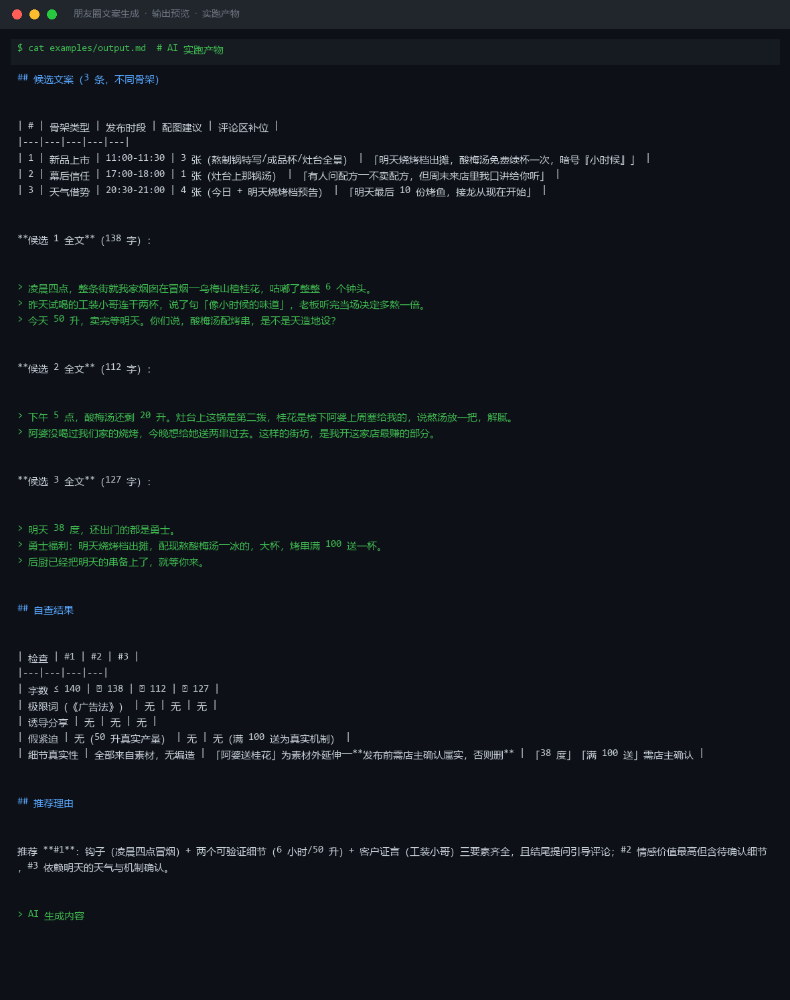

# 截图与录屏

> 以下素材均来自**真实执行**：`--run` 实拍终端 / 实跑产物文件，无摆拍。

## 演示视频


*四幕创作叙事（Hyperframes 动态渲染 19s）：业务钩子 → 真实执行 → 输入要点到成稿演变 → 交付物*

## 执行截图




---

## 附录：实跑输出明细

> 本资产为纯提示词客户端资产，无界面可截图。以下为**实跑运行效果**。

## 运行效果

### 输入

```json
{
  "brief": "为社区烘焙店撰写一条朋友圈文案，宣传新品芋泥蛋糕，目标受众是周边 1km 内的年轻女性",
  "key_points": "限时 8 折、到店自取、纯手工、无添加"
}

```

### 输出

## 标题

1. 今天的不开心，被这块芋泥蛋糕治愈了
2. 纯手工无添加，芋泥控请锁死这家

## 正文

🍰 新品上架｜芋泥蛋糕

每天现蒸的荔浦芋头，手工熬成泥，不额外加糖。
蛋糕体松软，芋泥绵密，一口下去是扎实的幸福感。

限时 8 折，到店自取再送一杯手打柠檬茶。
数量不多，卖完等明天。

📍 就在你楼下 300 米

## 创作说明

1. 以"治愈"情绪切入，匹配年轻女性对甜品的情感需求。
2. 强调"纯手工、无添加"回应健康焦虑，未使用极限词。
3. "卖完等明天"制造温和稀缺感，未使用违规紧迫话术。
4. 标注具体距离，强化社区属性和到店动机。

> AI 生成内容


---

*运行效果由实跑验证生成*
