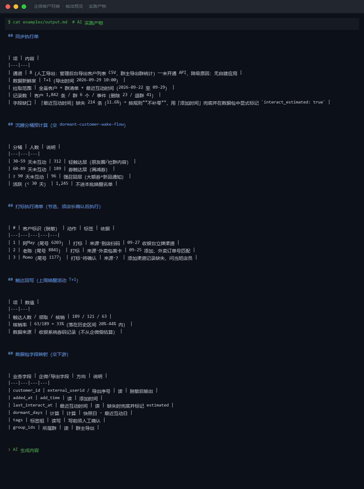
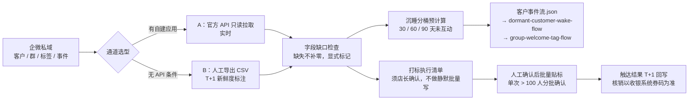

# 企微客户对接 WeCom Customer Sync

> 原子技能 ｜ 属于「复购管家」 ｜ 本地生活商家客群 ｜ T4 调度型（连接器 SOP，只读优先）
>
> **把企微里的客户/群/标签/事件数据按 SOP 安全取出、送进分层与触达技能，再把执行结果写回——写操作全部设人工确认点。**
> 双通道设计（A 官方 API 优先 / B 人工导出降级）· 3 条同步链路（每日增量 4 步 / 每周全量 3 步 / T+1 回写）· 5 条个人信息保护红线 · 凭证永不落盘




*上图来自实跑产物：1,842 个客户 / 6 个群走通道 B 人工导出，「最近互动时间」缺失 214 条（11.6%）按规则**不补零**、显式标记 `interact_estimated: true`，沉睡分桶 312 / 189 / 96 人直接交给唤醒工作流消费。*

---

## 它做什么（先定通道，再谈同步）

### 连接器授权双通道

| 项 | 通道 A：企微官方 API（优先） | 通道 B：人工导出（降级） |
|---|---|---|
| 前置条件 | 管理员创建自建应用，授「客户联系」只读权限 | 管理后台导出客户列表 CSV / 群主导出统计 |
| 可读数据 | 客户列表、添加时间、标签、所属群、删除/拉黑事件 | 客户标识、添加时间、最近互动时间、所属群 |
| 数据新鲜度 | 实时 | T+1（人工导出时间） |
| 适用 | 有企微管理权限的门店 | 单店、客户 < 2000 人，每天最多同步一次 |

**降级规则**：通道 A 授权失败 → 立即切通道 B 并标注新鲜度；**禁止**为"自动化"改用第三方爬虫/非官方工具（封号风险，见 [account-ban-risk-control](../account-ban-risk-control/)）。

### 三条同步链路

| 链路 | 节奏 | 关键动作 | 人工确认点 |
|---|---|---|---|
| 每日增量 | 营业结束后 22:00 | 拉新增客户 → 事件流（删除/拉黑/退群）→ 比对标签 → 产出数据包 | 删除率 > 5% 次日停止群发；打标清单店主过目后执行 |
| 每周全量 | 每周一 10:00 | 全量快照 diff（波动 > 10% 人工核对）→ 群清单 → 沉睡分桶预计算 30/60/90 天 | 客户数波动核对 |
| 触达回写 | 每次活动后 T+1 | 回写触达时间/渠道/券码/领取/核销 | 名单与数量由店主核对后回写 |

## 真实输入 → 真实输出

**输入**（`examples/input.json`）：门店私域现状（客户规模、群清单、导出文件/API 凭证状态）。

**输出**（AI 实跑，节选）：

| 项 | 内容 |
|---|---|
| 通道 | B（人工导出）——未开通 API，降级原因：无自建应用 |
| 记录数 | 客户 1,842 条 / 群 6 个 / 事件（删除 23 / 退群 41） |
| 字段缺口 | 「最近互动时间」缺失 214 条（11.6%）→ 不补零，兜底并标记 estimated |

沉睡分桶预计算（交 dormant-customer-wake-flow）：

| 分桶 | 人数 | 说明 |
|---|---|---|
| 30-59 天未互动 | 312 | 轻触达层（朋友圈/社群内容） |
| 60-89 天未互动 | 189 | 券触达层（满减券） |
| ≥ 90 天未互动 | 96 | 强召回层（大额券+新品通知） |

打标清单（须店长确认后执行，全部脱敏输出）：

| # | 客户标识（脱敏） | 动作 | 标签 | 依据 |
|---|---|---|---|---|
| 1 | 阿May（尾号 6203） | 打标 | 来源-到店扫码 | 09-27 收银台立牌渠道 |
| 2 | Momo（尾号 1177） | 打标-待确认 | 来源-？ | 渠道记录缺失，问当班店员，不许猜 |

完整同步执行单 + 触达回写台账见 [`examples/output.md`](examples/output.md)。

## 处理流水线



## 快速开始

```text
1. 打开 prompt.txt，全文复制
2. 粘贴到 Coze / WorkBuddy / Dify / Claude / ChatGPT
3. 按 schema.json 的输入规格提供：通道状态（API/导出）+ 客户/群数据文件
```

## 面向谁 / 什么时候用

| ✅ 该用 | ❌ 别用 |
|---|---|
| 给沉睡唤醒 / 迎新打标等工作流喂数据 | 导出聊天内容全文（只同步元数据，内容属通信秘密） |
| 无 API 条件时的导出文件字段映射 | 用爬虫/协议 bot 连企微（封号+违法风险，一律拒绝） |
| 活动后的券码核销回写台账 | 静默批量写标签（写操作必须有人工确认点） |

## 边界与合规

- 本资产输出为 **AI 生成内容**，是 SOP 与字段映射说明，不构成法律意见
- 遵守《个人信息保护法》：最小必要、告知用途、可删除（3 个工作日内留痕删除）、可退出
- **数据红线**：corpid/secret/token 不出现在对话/脚本/产物文件里；手机号产物中只留后 4 位；客户数据不二次转卖、不给第三方
- 企微接口能力以官方文档为准；平台规则更新后本 SOP 需同步维护

## 文件地图

```text
├── README.md            ← 本文件
├── SKILL.md             ← 资产定义（元信息 / 契约 / 边界）
├── prompt.txt           ← 提示词本体（双通道 SOP + 同步链路 + 合规红线）
├── schema.json          ← 输入输出契约（机器可读）
├── examples/            ← 真实输入 + AI 实跑输出
└── docs/                ← 9 项配套文档（架构 / 流程 / 场景 / 测试报告…）
```

---

*本资产遵循 [bangwozuo 数字员工资产规范](https://github.com/bangwozuo/digital-employee-spec) v3.0 ｜ [所属员工：复购管家](../../) ｜ [总入口](https://github.com/bangwozuo/digital-employees-hub-zh)*
