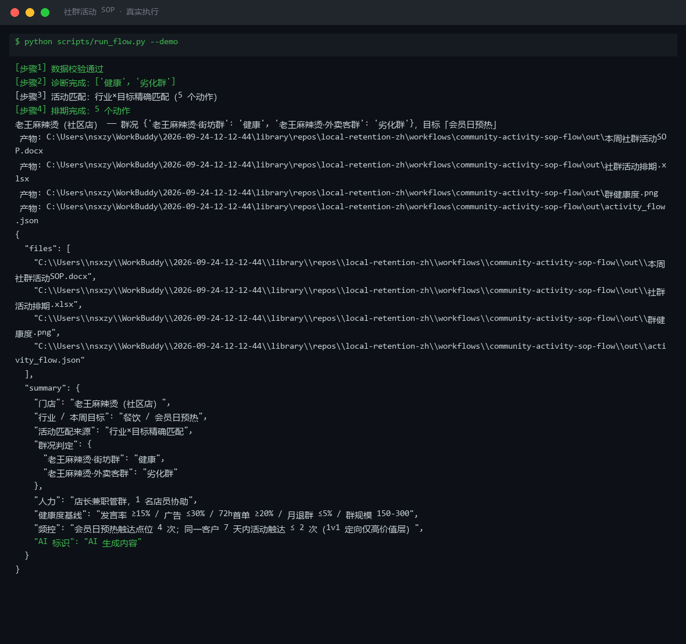
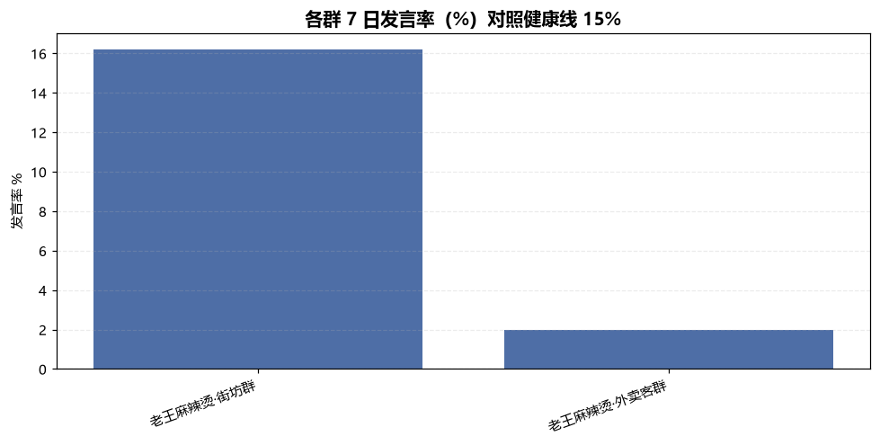
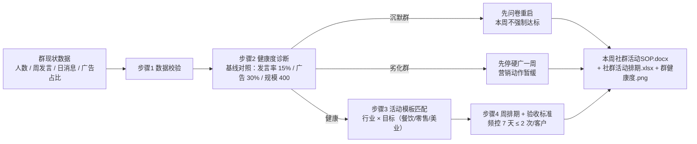

# 社群活动 SOP Community Activity SOP Flow

> 复合技能（工作流） ｜ 属于「复购管家」 ｜ 本地生活商家客群 ｜ T3 工作流（脚本编排，确定性执行）
>
> **每周一推送本周社群活动方案：先做群健康度诊断（沉默/劣化先治再办活动），再按行业 × 目标匹配活动模板，排到天、拆到动作、带验收标准。**
> 触发：定时（每周一推送本周 SOP） ｜ 依赖：[community-sop-library](../../skills/community-sop-library/) 活动模板库
> 健康度基线全量化：发言率 ≥15% / 广告占比 ≤30% / 72h 首单 ≥20% / 月退群 ≤5% / 群规模 150-300 · 频控 7 天 ≤ 2 次/客户



🎬 **[▶ 观看演示视频](docs/assets/demo.mp4)** — 四幕检测叙事：业务钩子 → 真实执行 → 检查项逐条亮灯 → 交付物

*上图来自真实执行（每日鲜样例）：2 个群均判「健康」（发言率 17%，广告占比 24%/12% 在基线内），「零售 × 清库存」精确匹配 3 个活动动作，产物一次落盘 SOP 报告 Word + 排期 Excel + 健康度图 + JSON 共 4 件。*



*各群 7 日发言率对照健康线 15%（脚本实跑产物 `out/群健康度.png`）。*

---

## 它做什么（四步编排）

| 步骤 | 动作 | 规则 |
|---|---|---|
| 1 数据校验 | 群列表 + 行业必需 | 缺失 → 退出码 2 |
| 2 健康度诊断 | 逐群对照基线判定：健康 / 待激活 / 沉默群 / 劣化群 | 发言率 < 8% 沉默群先问卷重启；广告占比 > 50% 劣化群先停硬广；> 400 人建议拆群 |
| 3 活动模板匹配 | 行业 × 目标查模板库（餐饮/零售/美业 × 拉新/复购/清库存/会员日） | 无精确匹配 → 行业通选模板，不硬编 |
| 4 周排期与验收 | 每个动作带时段 + 量化验收标准 | 沉默/劣化群的验收自动放宽并注明；触达频控核对 |

### 活动模板库（节选）

| 行业 × 目标 | 动作 | 验收标准 |
|---|---|---|
| 餐饮 × 会员日预热 | D-3 新品投票 → D-2 晒后厨 → D-1 老客 1v1 → 当天开启 → 次日真实战报 | 投票 ≥ 群人数 12%；战报以收银台账为准 |
| 零售 × 清库存 | 临期盘点定价 → 群内秒杀（限 30 份，晚 8 点）→ 满额赠正价小样 | 2 小时售罄率 ≥ 80%；连带率 ≥ 30% |
| 美业 × 空位变现 | 作品日 → 空位闪订（次日空位 5 折限 2 个）→ 客户返图日 | 闪订成功率 ≥ 50%；返图 ≥ 3 张 |

## 真实输入 → 真实输出

**输入**（`examples/input.json`）：门店 + 行业/本周目标 + 人力 + 群现状（人数/周发言/日消息/广告占比）。

**输出**（脚本实跑，节选）：

| 群名 | 人数 | 7日发言率 | 广告占比 | 判定 | 诊断说明 |
|---|---|---|---|---|---|
| 每日鲜·邻里群 | 210 | 17% | 24% | 健康 | 指标正常 |
| 每日鲜·团购二群 | 118 | 17% | 12% | 健康 | 指标正常 |

周排期（零售 × 清库存）：

| 动作 | 时段 | 验收标准 |
|---|---|---|
| 临期清单盘点 + 定价 | 周一 | 清库存毛利 ≥ 0 |
| 群内秒杀（限 30 份，晚 8 点） | 周三 20:00 | 2 小时售罄率 ≥ 80% |
| 秒杀连带满额赠正价小样 | 周三 20:00 | 连带率 ≥ 30% |

完整排期见 [`examples/output.md`](examples/output.md)；产物：`out/本周社群活动SOP.docx`（含诊断表 + 排期表 + 频控合规段）+ `out/社群活动排期.xlsx` + `out/群健康度.png`。

## 处理流水线



## 快速开始

```bash
# 演示模式（内置真实样例）
python scripts/run_flow.py --demo
# 指定输入
python scripts/run_flow.py --input examples/input.json --outdir out
```

提示词方式：活动话术与物料文案由模型按社区 SOP 模板库生成（诊断与排期为规则计算）。

## 面向谁 / 什么时候用

| ✅ 该用 | ❌ 别用 |
|---|---|
| 每周一出本周活动排期，照表执行 | 替代店主决策（活动价格与会员专属价成本须店主确认） |
| 沉默群 / 劣化群的先治后办 | 群成员 < 50 的起步期硬排活动 |
| 会员日 / 清库存 / 空位变现专项 | 承诺转化率（只给基线区间与自身台账对比） |

## 边界与合规

- 本工作流产物为 **AI 生成内容**，SOP 为运营建议，执行前经店主确认
- 频控红线：同一客户 7 天内活动触达 ≤ 2 次（1v1 定向仅高价值层）；禁屏时段 22:30-9:00 不发营销
- 禁止转发门槛裂变（老带新用双向奖励）；投诉 30 分钟内响应不删评；战报数据以收银台账为准、公示脱敏

## 文件地图

```text
├── README.md            ← 本文件
├── SKILL.md             ← 工作流定义（步骤 / 契约 / 边界）
├── prompt.txt           ← 提示词本体（活动话术与物料文案）
├── schema.json          ← 输入输出契约（机器可读）
├── scripts/run_flow.py  ← 端到端编排脚本（校验→诊断→匹配→排期→产物）
├── examples/            ← 真实输入 + 脚本实跑输出
├── docs/                ← 9 项配套文档（架构 / 流程 / 场景 / 测试报告…）
└── out/                 ← 实跑产物（SOP.docx / 排期.xlsx / 群健康度.png / activity_flow.json）
```

---

*本资产遵循 [bangwozuo 数字员工资产规范](https://github.com/bangwozuo/digital-employee-spec) v3.0 ｜ [所属员工：复购管家](../../) ｜ [总入口](https://github.com/bangwozuo/digital-employees-hub-zh)*
