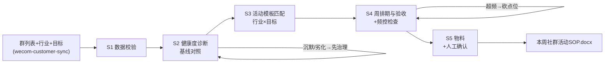

# 社群活动 SOP

把「群列表 + 行业 + 本周目标」加工成可执行的周活动 SOP：健康状态、排什么、几点做、达标数字、有无超频。

**健康度诊断与活动匹配由 `scripts/run_flow.py` 计算，模型负责活动机制细化与物料文案。**

## 能力描述

按「先诊断再排期」的顺序编排：数据校验（发言数据须来自真实导出）→ 群健康度诊断（群规模 150-300、7 日发言率 ≥ 15% 健康 / < 8% 沉默 / 广告占比 > 50% 劣化，> 400 人提示拆群）→ 活动模板匹配（餐饮/零售/美业 × 会员日预热/拉新/清库存/空位变现，无匹配落通选并标注）→ 周排期（每个动作带时段 + 量化验收标准，7 天内触达 ≤ 2 次，兼职人力砍动作不砍验收）→ 物料清单与人工确认点，产出 SOP 报告 Word。病群先治理：沉默群只排问卷重启、劣化群先停硬广。

## 元信息

| 字段 | 值 |
|------|-----|
| ID | `de_local_03_wf03` |
| 类型 | **`composite`（复合技能 / T3 工作流）** |
| 所属员工 | 复购管家 |
| 阶段 | `P0` |
| 复杂度 | `M` |
| 触发方式 | 定时（每周一 10:00，随 wecom-customer-sync 全量同步） |
| 资产形态 | 编排提示词 + Python 编排脚本（无模型调用、无 API Key） |

## 编排的原子技能

| # | 原子技能 | 在本流程中的角色 |
|---|---------|------|
| 1 | [社群 SOP 模板库](../../skills/community-sop-library/) | 健康度基线、行业周节奏与生命周期 SOP 规则来源 |
| 2 | [企微客户对接](../../skills/wecom-customer-sync/) | 群列表与发言数据源（每周全量） |
| 3 | [封号合规风控](../../skills/account-ban-risk-control/) | 触达频控与裂变合规把关 |

## 步骤链路（DAG）



## 步骤明细

| # | 步骤 | 执行者 | 输入 | 输出 | 失败处理 |
|---|------|---------|------|------|---------|
| 1 | 数据校验 | 脚本 | 群列表 + 行业 + 目标 | 合格数据集 | 缺字段退出码 2；广告占比缺失标注「未知」 |
| 2 | 健康度诊断 | 脚本 | 群数据 | 健康/待激活/沉默/劣化判定 | 沉默群只排问卷重启；劣化群先停硬广 |
| 3 | 活动匹配 | 脚本 | 行业 × 目标 | 活动动作集 | 无匹配 → 通选模板并标注 |
| 4 | 排期与验收 | 脚本 | 动作集 + 诊断 | 带数字目标的排期 | 验收不可量化退回；超频砍点位 |
| 5 | 物料与确认 | 模型+人工 | 排期表 | SOP 报告 + 物料清单 | 战报以收银台账为准；群况突变当日暂停 |

## 输入规格

| 字段 | 类型 | 必填 | 说明 |
|------|------|------|------|
| `shop` | string | ✅ | 门店名 |
| `industry` | string | ✅ | 餐饮 / 零售 / 美业 / 其他 |
| `week_goal` | string | ⬜ | 本周目标：会员日预热 / 拉新 / 清库存 / 空位变现 / 常规运营 |
| `staff` | string | ⬜ | 群主人力（决定动作密度） |
| `groups` | array | ✅ | [{name, members, weekly_speakers, daily_msgs, ad_ratio}]，数据来自真实导出 |

## 输出规格

| 字段 | 类型 | 说明 |
|------|------|------|
| `summary` | object | 群况判定 / 活动匹配来源 / 健康度基线 / 频控说明 |
| `diagnosis` | array | 逐群诊断（发言率/广告占比/判定/说明） |
| `schedule` | array | 周排期（动作/时段/量化验收标准） |
| 产物 | 文件 | `out/本周社群活动SOP.docx`、`out/社群活动排期.xlsx`、`out/群健康度.png`、`out/activity_flow.json` |

## 验收标准

- [ ] 每一步的技能资产齐全（SKILL.md / prompt.txt / schema.json）
- [ ] 步骤间输入输出字段可衔接（群数据 → 诊断 → 匹配 → 排期 → 物料）
- [ ] 病群不排强活动；每个动作带量化验收；触达 ≤ 2 次/7 天
- [ ] 末步输出带 AI 生成标识，活动价格与名单经人工确认

## 使用步骤

### 方式一：带脚本（推荐，端到端）

```bash
python3 <WF_DIR>/scripts/run_flow.py --input input.json --outdir out
python3 <WF_DIR>/scripts/run_flow.py --demo
```

### 方式二：纯对话编排

把 `prompt.txt` 全文粘贴为系统提示词 → 提供群列表与目标 → 按 DAG 逐步执行，末步产出 SOP 报告。

### 平台编排

| 平台 | 编排方式 |
|------|---------|
| **Coze / 扣子** | 新建工作流 → 按步骤添加节点 |
| **Dify** | Workflow → LLM 节点链 + 代码节点（诊断与匹配） |
| **WorkBuddy** | 新建 Skill 按步骤串联各技能提示词 |

## 边界（不做的事）

- ❌ 不给病群排强活动——沉默群先问卷重启、劣化群先停硬广
- ❌ 不做无验收的活动——每个动作必须带数字目标，办完必须对数
- ❌ 不超频触达——7 天内同一客户 ≤ 2 次，预热点位砍完还不够就删活动
- ❌ 不做转发门槛裂变——拉新只用老带新双向奖励；不编战报（以收银台账为准）
- ❌ 无精确模板的新业态用通选模板并显式标注，不冒充行业定制

## 调用示例

**输入**（`examples/input.json`）：每日鲜生鲜便利店（零售），本周目标「清库存」，2 个群（210 人发言率 17%、118 人发言率 17%）。

**输出**（脚本实跑，退出码 0）：两群均判「健康」；匹配零售×清库存模板，3 个动作——

| 动作 | 时段 | 验收标准 |
|---|---|---|
| 临期清单盘点 + 定价 | 周一 | 清库存毛利 ≥ 0 |
| 群内秒杀（限 30 份，晚 8 点） | 周三 20:00 | 2 小时售罄率 ≥ 80% |
| 秒杀连带满额赠正价小样 | 周三 20:00 | 连带率 ≥ 30% |

产物四件：SOP 报告 Word（含诊断表与人工确认点）、排期 Excel、群健康度 PNG、机器可读 JSON。

## 所属工作流

本资产为复合技能（工作流），是独立的端到端流程，不隶属于其他工作流。

## 合规声明

- 本技能输出为 **AI 辅助生成内容**，活动价格与机制执行前必须经店主人工确认
- 红包/券台账可对账，中奖公示脱敏；触达频控遵守微信平台规则
- 群内不透露其他客户信息；战报数据以收银台账为准

---

*本复合技能遵循 [bangwozuo 数字员工资产规范](https://github.com/bangwozuo/digital-employee-spec) v3.0*
