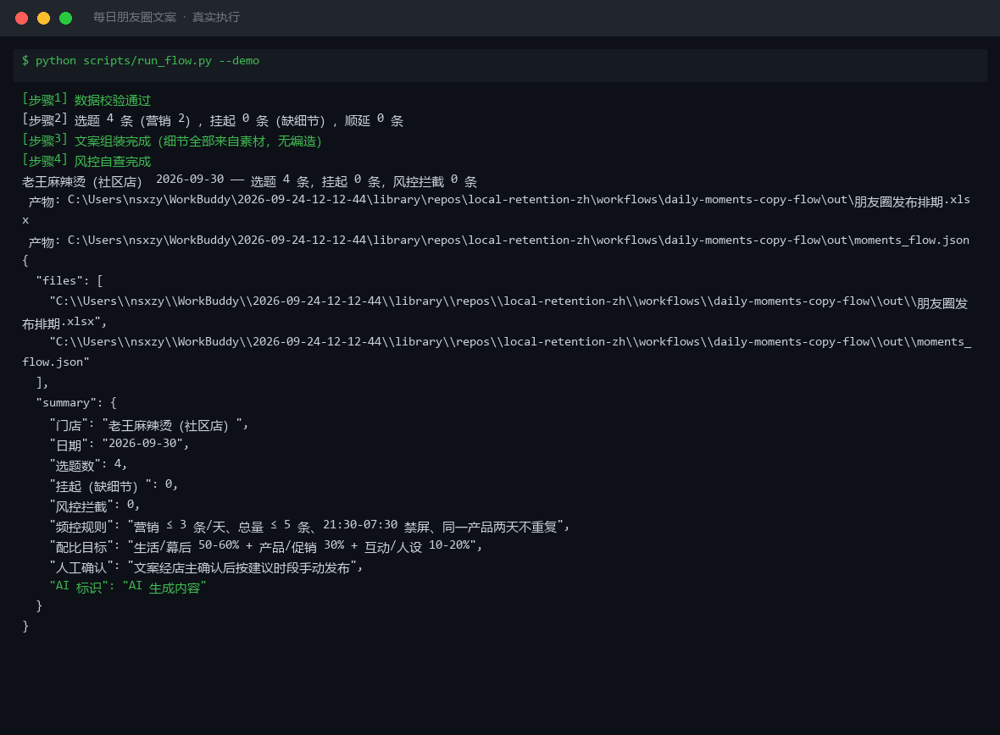
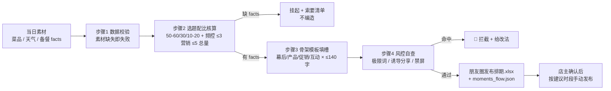

# 每日朋友圈文案 Daily Moments Copy Flow

> 复合技能（工作流） ｜ 属于「复购管家」 ｜ 本地生活商家客群 ｜ T3 工作流（脚本编排，确定性执行）
>
> **结合当日菜品/天气/热点，每天 7:30 推送 3 条"像人话"的朋友圈候选——配比、频控、风控全部机器把关，解决"每天发什么"的枯竭痛点。**
> 触发：定时（每日 7:30 推送 3 条候选） ｜ 依赖：[moments-copy-generate](../../skills/moments-copy-generate/) 做文案成文
> 硬规则：内容配比 幕后 50-60% + 产品/促销 30% + 互动 10-20% · 营销 ≤ 3 条/天、总量 ≤ 5 条 · 文案 ≤ 140 字防折叠 · 21:30-07:30 禁屏



🎬 **[▶ 观看演示视频](docs/assets/demo.mp4)** — 四幕检测叙事：业务钩子 → 真实执行 → 检查项逐条亮灯 → 交付物

*上图来自真实执行（青禾轻食样例）：4 条素材选题 3 条、挂起 1 条（新沙拉缺细节→生成索要清单不硬写）、风控拦截 1 条（「全网第一」命中《广告法》极限词），产物落盘发布排期 Excel + JSON。*

---

## 它做什么（四步编排）

| 步骤 | 动作 | 规则 |
|---|---|---|
| 1 数据校验 | 素材列表必需，缺失 → 退出码 2 | 不硬写 |
| 2 选题配比核算 | 按内容配比排班 + 频控核算 | 营销超配 → 砍量顺延；缺 facts → 挂起并出「索要清单」 |
| 3 候选文案组装 | 骨架模板（幕后/产品/促销/互动）+ 真实素材细节填槽 | 细节全部来自素材，无编造；字数 ≤ 140 |
| 4 风控自查 | 极限词词表 + 诱导分享词扫描 + 禁屏时段检查 | 命中即拦截并给改法；广告腔（「好吃」「匠心」）标 🟡 提示 |

### 风控词表（内置）

| 类型 | 命中示例 | 处理 |
|---|---|---|
| 极限词（《广告法》第九条） | 最好 / 第一 / 全网 / 独家 / 100% | 🔴 拦截 → 改为具体可验证描述（如「今天卖出了 43 份」） |
| 诱导分享（微信外部内容规范） | 转发领取 / 集赞 / 分享才能 | 🔴 拦截 → 改「进群直接领」，分享不设门槛 |
| 广告腔（SUSPECT 词） | 好吃 / 美味 / 匠心 / 欢迎品尝 | 🟡 提示替换为具体细节 |

### 发布时段槽位（按到店决策点）

07:30-09:00 早餐档 → 11:00-11:30 午市前 → 17:00-18:00 晚市前 → 20:30-21:00 情感档（21:30 后禁屏）。

## 真实输入 → 真实输出

**输入**（`examples/input.json`）：门店 + 日期/天气 + 今日已发条数 + 素材列表（每条带 facts 真实细节）。

**输出**（脚本实跑，节选）：

| 选题 | 类型 | 发布时段 | 风控判定 | 风控明细 |
|---|---|---|---|---|
| 现熬骨汤 | 幕后 | 07:30-09:00 早餐档 | 通过 | 无 |
| 全网第一轻食 | 促销 | — | **拦截** | 🔴 极限词：命中「全网 / 第一」→ 改为具体可验证描述 |
| 后厨备菜 | 幕后 | 07:30-09:00 早餐档 | 通过 | 无 |
| 新沙拉 | 产品 | 挂起 | 挂起 | 素材缺细节 → 索要清单：今早备料几点？用了多少斤？ |

完整排期见 [`examples/output.md`](examples/output.md)；产物：`out/朋友圈发布排期.xlsx`（拦截行自动标红）。

## 处理流水线



## 快速开始

```bash
# 演示模式（内置真实样例）
python scripts/run_flow.py --demo
# 指定输入
python scripts/run_flow.py --input examples/input.json --outdir out
```

提示词方式：文案润色与配图实拍方向见 [moments-copy-generate](../../skills/moments-copy-generate/)（排期与风控为规则计算）。

## 面向谁 / 什么时候用

| ✅ 该用 | ❌ 别用 |
|---|---|
| 每天早上 3 条候选，店主挑 1 条发 | 无人值守自动发朋友圈（必须店主过目） |
| 素材缺细节时让机器开口向店主索要 | 编造「今早现摘」类假细节凑数 |
| 营销条数超配时的自动砍量顺延 | 极限词硬闯（拦截行不允许发布） |

## 边界与合规

- 本工作流产物为 **AI 生成内容**，文案经店主确认后按建议时段**手动发布**
- 极限词命中即拦截——《广告法》第九条口径；促销理由必须真实（临期就是临期）
- 同一产品两天不重复出现；客户返图/昵称使用前须获本人同意

## 文件地图

```text
├── README.md            ← 本文件
├── SKILL.md             ← 工作流定义（步骤 / 契约 / 边界）
├── prompt.txt           ← 提示词本体（文案成文与润色）
├── schema.json          ← 输入输出契约（机器可读）
├── scripts/run_flow.py  ← 端到端编排脚本（校验→配比→组装→风控→产物）
├── examples/            ← 真实输入 + 脚本实跑输出
├── docs/                ← 9 项配套文档（架构 / 流程 / 场景 / 测试报告…）
└── out/                 ← 实跑产物（朋友圈发布排期.xlsx / moments_flow.json）
```

---

*本资产遵循 [bangwozuo 数字员工资产规范](https://github.com/bangwozuo/digital-employee-spec) v3.0 ｜ [所属员工：复购管家](../../) ｜ [总入口](https://github.com/bangwozuo/digital-employees-hub-zh)*
