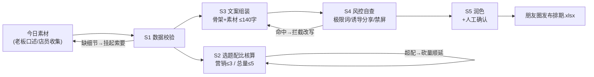

# 每日朋友圈文案

把「今日素材」加工成当天可发的朋友圈排期表：发哪几条、几点发、文案是什么、有没有踩线。

**配比核算、骨架组装与风控扫描由 `scripts/run_flow.py` 完成，模型负责润色与改写被拦截项。**

## 能力描述

按「素材 → 排期 → 定稿」的流水线编排：数据校验（素材缺 facts 挂起并生成索要清单，不编细节）→ 选题配比核算（营销 ≤ 3 条/天、总量 ≤ 5 条、21:30-07:30 禁屏，超配顺延）→ 文案组装（幕后/产品/促销/互动四种骨架 + 真实素材细节，≤ 140 字防折叠）→ 风控自查（极限词/诱导分享词表扫描命中即拦截，广告腔标缓行）→ 店主人设润色（不新增事实）与人工确认。

## 元信息

| 字段 | 值 |
|------|-----|
| ID | `de_local_03_wf02` |
| 类型 | **`composite`（复合技能 / T3 工作流）** |
| 所属员工 | 复购管家 |
| 阶段 | `P0` |
| 复杂度 | `S` |
| 触发方式 | 定时（每天营业前 1 小时） |
| 资产形态 | 编排提示词 + Python 编排脚本（无模型调用、无 API Key） |

## 编排的原子技能

| # | 原子技能 | 在本流程中的角色 |
|---|---------|------|
| 1 | [朋友圈文案生成](../../skills/moments-copy-generate/) | 骨架模板、五关写作规则与配比口径来源 |
| 2 | [封号合规风控](../../skills/account-ban-risk-control/) | 极限词/诱导分享/频控红线的审查规则来源 |

## 步骤链路（DAG）



## 步骤明细

| # | 步骤 | 执行者 | 输入 | 输出 | 失败处理 |
|---|------|---------|------|------|---------|
| 1 | 数据校验 | 脚本 | 素材列表 + 今日已发 | 合格素材集 | 缺 facts 挂起并生成索要清单，不编造 |
| 2 | 选题配比 | 脚本 | 合格素材集 | 当日选题与砍量 | 营销超 3 条顺延；今日已超配则不发 |
| 3 | 文案组装 | 脚本 | 选题 + facts | 骨架文案 ≤140 字 | 超字数留钩子+首细节，余下进评论区 |
| 4 | 风控自查 | 脚本 | 候选文案 | 通过/缓行/拦截 | 🔴 拦截项改写后重扫，改不动就砍 |
| 5 | 润色确认 | 模型+人工 | 排期表 | 定稿排期 | 润色不新增事实；老板砍单按砍后执行 |

## 输入规格

| 字段 | 类型 | 必填 | 说明 |
|------|------|------|------|
| `shop` | string | ✅ | 门店名 |
| `date` | string | ⬜ | 日期（缺省取当天） |
| `today_sent` | object | ⬜ | 今日已发 {total, marketing}，用于频控核算 |
| `materials` | array | ✅ | [{topic, type（幕后/产品/促销/互动）, facts:[真实细节]}]，facts 是命根子 |

## 输出规格

| 字段 | 类型 | 说明 |
|------|------|------|
| `summary` | object | 选题数 / 挂起数 / 拦截数 / 频控与配比规则 |
| `items` | array | 排期表（选题/类型/时段/文案/字数/风控判定/明细/索要清单） |
| 产物 | 文件 | `out/朋友圈发布排期.xlsx`（拦截行标红）、`out/moments_flow.json` |

## 验收标准

- [ ] 每一步的技能资产齐全（SKILL.md / prompt.txt / schema.json）
- [ ] 步骤间输入输出字段可衔接（素材 → 选题 → 文案 → 风控 → 排期）
- [ ] 无编造细节；极限词/诱导分享零漏拦；文案 ≤ 140 字
- [ ] 末步输出带 AI 生成标识，文案经店主确认后发布

## 使用步骤

### 方式一：带脚本（推荐，端到端）

```bash
python3 <WF_DIR>/scripts/run_flow.py --input input.json --outdir out
python3 <WF_DIR>/scripts/run_flow.py --demo
```

### 方式二：纯对话编排

把 `prompt.txt` 全文粘贴为系统提示词 → 提供今日素材 → 按 DAG 逐步执行，末步产出排期表。

### 平台编排

| 平台 | 编排方式 |
|------|---------|
| **Coze / 扣子** | 新建工作流 → 按步骤添加节点 |
| **Dify** | Workflow → LLM 节点链 + 代码节点（排期与词表扫描） |
| **WorkBuddy** | 新建 Skill 按步骤串联各技能提示词 |

## 边界（不做的事）

- ❌ 不编细节——素材没给的「现摘」「排队爆了」一律不出现
- ❌ 不用极限词——命中词表即拦截，改写不得用谐音替代
- ❌ 不做诱导分享——「转发才能领」零容忍，改「进群直接领」
- ❌ 不超频——营销已满 3 条就顺延，文案再好也不加塞；不做假紧迫
- ❌ 润色不得新增事实——只改表达不添内容

## 调用示例

**输入**（`examples/input.json`）：青禾轻食 9-29，5 条素材（含 1 条缺细节、1 条含「全网第一」、1 条营销超配）。

**输出**（脚本实跑，退出码 0）：

| 选题 | 类型 | 风控判定 | 说明 |
|---|---|---|---|
| 牛油果能量碗 | 产品 | 通过 | 「牛油果今早到货 20 个，熟度刚好」（61 字） |
| 全网第一轻食 | 促销 | 🔴 拦截 | 命中极限词「全网」→ 改为具体可验证描述 |
| 后厨备菜 | 幕后 | 通过 | 「早上 6 点半到店洗菜切菜，鸡胸肉腌了 40 盒」（47 字） |
| 周末套餐预告 | 促销 | 通过 | 营销超配 → 顺延明日 |
| 新沙拉 | 产品 | 挂起 | 缺细节 → 索要清单（几点到货？几份？客人原话？） |

选题 4 条、挂起 1 条、拦截 1 条，风控明细全部落表。

## 所属工作流

本资产为复合技能（工作流），是独立的端到端流程，不隶属于其他工作流。

## 合规声明

- 本技能输出为 **AI 辅助生成内容**，文案发布前必须经店主人工确认
- 极限词与价格促销遵守《广告法》；原价真实有依据
- 客户返图与昵称使用前获本人同意；触达频控遵守微信平台规则

---

*本复合技能遵循 [bangwozuo 数字员工资产规范](https://github.com/bangwozuo/digital-employee-spec) v3.0*
