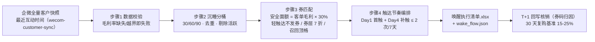

# 沉睡客户唤醒 Dormant Customer Wake Flow

> 复合技能（工作流） ｜ 属于「复购管家」 ｜ 本地生活商家客群 ｜ T3 工作流（脚本编排，确定性执行）
>
> **每周扫描企微私域，把 30 天未互动客户按 30/60/90 天分桶，逐人配安全面额券与触达节奏——唤醒 5% 沉睡客户 ≈ 月增数千元营收。**
> 触发：定时（每周扫描） ｜ 依赖：[wecom-customer-sync](../../skills/wecom-customer-sync/) 沉睡分桶预计算 + [coupon-strategy](../../skills/coupon-strategy/) 安全面额规则
> 硬规则：面额 ≤ 客单毛利 × 30% · 同一客户 7 天内触达 ≤ 2 次 · 去重、活跃客户不进名单 · 缺毛利率直接失败不编造


🎬 **[▶ 观看演示视频](docs/assets/demo.mp4)** — 四幕检测叙事：业务钩子 → 真实执行 → 检查项逐条亮灯 → 交付物

*上图来自真实执行（青禾轻食样例）：8 条客户记录去重、剔除活跃后 6 人进唤醒名单，按 30-59 / 60-89 / ≥90 天三桶分层（轻触达 / 券触达 / 强召回），券预算上限实跑测算，产物落盘执行清单 Excel + JSON。*

---

## 它做什么（四步编排）

| 步骤 | 动作 | 规则 |
|---|---|---|
| 1 数据校验 | customers + 毛利率（0-1 小数）必需 | 缺失/越界 → 退出码 2，不补零不编造 |
| 2 沉睡分桶 | 30-59 / 60-89 / ≥90 天三桶 | 去重；< 30 天活跃客户不进名单 |
| 3 券匹配 | 安全面额 = 客单毛利 × 30% | 轻触达层不发券；券触达层 7 折安全线；强召回层顶格 |
| 4 触达节奏 | Day1 首触 + Day4 补触（仅券层） | 同一客户 7 天内触达 ≤ 2 次，全部合规 |

### 分层触达策略

| 分桶 | 触达层 | 动作 | 券策略 |
|---|---|---|---|
| 30-59 天 | 轻触达 | 朋友圈内容 + 社群互动 | 不发券（内容触达） |
| 60-89 天 | 券触达 | 满减券 1v1 发放 | 安全线 × 0.7（满 客单×1.3 减） |
| ≥ 90 天 | 强召回 | 大额券 + 新品通知 1v1 | 顶格安全线（客单毛利 × 30%） |

## 真实输入 → 真实输出

**输入**（`examples/input.json`）：门店 + 毛利率 + 客户列表（沉睡天数/客单价）。

**输出**（脚本实跑，节选）：

| 客户 | 沉睡天数 | 分桶 | 触达层 | 券 | 7天触达次数 |
|---|---|---|---|---|---|
| Nana | 130 | ≥90 天 | 强召回 | 满 57 减 8 | 2 |
| 老许 | 96 | ≥90 天 | 强召回 | 满 75 减 9 | 2 |
| 甜甜 | 85 | 60-89 天 | 券触达 | 满 52 减 5 | 2 |
| 周小姐 | 32 | 30-59 天 | 轻触达 | （本层不发券，内容触达） | 1 |

*注：阿昆（21 天）为活跃客户不进名单；小满（客单价缺失）按规则校验处理；重复记录自动去重。*

完整清单见 [`examples/output.md`](examples/output.md)；产物：`out/唤醒执行清单.xlsx`（≥90 天强召回行自动标红）。

## 处理流水线



## 快速开始

```bash
# 演示模式（内置真实样例）
python scripts/run_flow.py --demo
# 指定输入
python scripts/run_flow.py --input examples/input.json --outdir out
```

提示词方式：唤醒话术与触达文案由模型按各技能 prompt 生成（分桶/券/节奏为规则计算）。

## 面向谁 / 什么时候用

| ✅ 该用 | ❌ 别用 |
|---|---|
| 每周固定扫描私域，出本周唤醒名单 | 把唤醒券发给 30 天内刚消费的活跃客户（纯让利） |
| 唤醒后 30 天复购对照 15-25% 基线评估效果 | 承诺唤醒率（只能给测算区间） |
| 无历史核销数据时按 28% 起测并标注假设 | 按「到店就算活动带来」粗算归因（只认券码） |

## 边界与合规

- 本工作流产物为 **AI 生成内容**，发放名单与券方案执行前须经店主确认
- 频控是硬红线：同一客户 7 天内触达 ≤ 2 次——超频即骚扰，客户投诉直接危及主号
- 客户数据脱敏使用（手机号只留后 4 位）；核销数据以收银系统券码记录为准

## 文件地图

```text
├── README.md            ← 本文件
├── SKILL.md             ← 工作流定义（步骤 / 契约 / 边界）
├── prompt.txt           ← 提示词本体（唤醒话术与触达文案）
├── schema.json          ← 输入输出契约（机器可读）
├── scripts/run_flow.py  ← 端到端编排脚本（校验→分桶→券匹配→节奏→产物）
├── examples/            ← 真实输入 + 脚本实跑输出
├── docs/                ← 9 项配套文档（架构 / 流程 / 场景 / 测试报告…）
└── out/                 ← 实跑产物（唤醒执行清单.xlsx / wake_flow.json）
```

---

*本资产遵循 [bangwozuo 数字员工资产规范](https://github.com/bangwozuo/digital-employee-spec) v3.0 ｜ [所属员工：复购管家](../../) ｜ [总入口](https://github.com/bangwozuo/digital-employees-hub-zh)*
