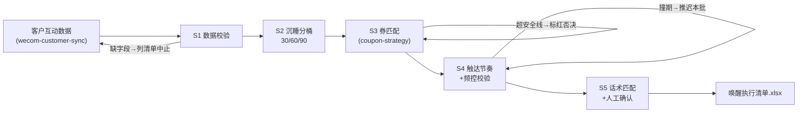

# 沉睡客户唤醒

把「客户互动数据」加工成可直接执行的唤醒作战表：谁、哪一层、发什么券、何时触达、失败怎么办。

**数值由 `scripts/run_flow.py` 计算，模型只做话术匹配与频控把关。**

## 能力描述

按「沉睡 30 天轻触达（朋友圈/社群内容）→ 60 天券触达（满减券）→ 90 天强召回（大额券+新品通知）」三段节奏编排：数据校验（缺字段列清单不编造）→ 按 R 分桶 30-59/60-89/≥90 → 券匹配（安全面额 = 客单毛利 × 30%，券触达层 7 折、召回层顶格）→ 触达节奏（Day1 首触 + Day4 补触，7 天内 ≤ 2 次）→ 话术匹配与人工确认。活跃客户（< 30 天）与客单价缺失客户自动剔除/挂起。

## 元信息

| 字段 | 值 |
|------|-----|
| ID | `de_local_03_wf04` |
| 类型 | **`composite`（复合技能 / T3 工作流）** |
| 所属员工 | 复购管家 |
| 阶段 | `P0` |
| 复杂度 | `M` |
| 触发方式 | 定时（每周一快照）或活动前置手动触发 |
| 资产形态 | 编排提示词 + Python 编排脚本（无模型调用、无 API Key） |

## 编排的原子技能

| # | 原子技能 | 在本流程中的角色 |
|---|---------|------|
| 1 | [企微客户对接](../../skills/wecom-customer-sync/) | 数据源：客户互动数据导出（A/B 双通道） |
| 2 | [优惠券策略](../../skills/coupon-strategy/) | 步骤 3 券匹配的规则来源（安全面额/门槛/ROI 口径） |
| 3 | [朋友圈文案生成](../../skills/moments-copy-generate/) | 轻触达层的内容话术 |
| 4 | [封号合规风控](../../skills/account-ban-risk-control/) | 触达前的频控与红线自查 |

## 步骤链路（DAG）



## 步骤明细

| # | 步骤 | 执行者 | 输入 | 输出 | 失败处理 |
|---|------|---------|------|------|---------|
| 1 | 数据校验 | 脚本 | 客户列表 + 毛利率 | 合格数据集 | 缺字段退出码 2 列清单；不编造不补零 |
| 2 | 沉睡分桶 | 脚本 | 合格数据集 | 30-59/60-89/≥90 三桶 | 桶空显式写 0 人；活跃客户剔除 |
| 3 | 券匹配 | 脚本 | 分桶名单 + coupon-strategy 规则 | 每人券方案 | 超安全线标红；客单价缺失挂起不发券 |
| 4 | 触达节奏 | 脚本 | 带券名单 | Day1/Day4 触达计划 | 7 天内已触达 2 次的剔除或推迟 |
| 5 | 话术与确认 | 模型+人工 | 执行清单 | 定稿话术 | 名单被砍按砍后执行；话术过风控自查 |

## 输入规格

| 字段 | 类型 | 必填 | 说明 |
|------|------|------|------|
| `shop` | string | ✅ | 门店名 |
| `毛利率` | number | ✅ | 0-1 小数 |
| `today` | string | ⬜ | 快照日（缺省取当天） |
| `customers` | array | ✅ | [{customer, dormant_days, 客单价}]，dormant_days = 快照日 − 最近互动日 |

## 输出规格

| 字段 | 类型 | 说明 |
|------|------|------|
| `summary` | object | 沉睡客户数 / 分桶计数 / 券预算上限 / 频控与基准说明 |
| `items` | array | 执行清单（客户/分桶/触达层/券/Day1/Day4/7天触达次数） |
| 产物 | 文件 | `out/唤醒执行清单.xlsx`（≥90 天标红）、`out/wake_flow.json` |

## 验收标准

- [ ] 每一步的技能资产齐全（SKILL.md / prompt.txt / schema.json）
- [ ] 步骤间输入输出字段可衔接（互动数据 → 分桶 → 券 → 节奏）
- [ ] 全部触达 ≤ 2 次/7 天，无活跃客户误入名单
- [ ] 末步输出带 AI 生成标识，名单经人工确认

## 使用步骤

### 方式一：带脚本（推荐，端到端）

```bash
python3 <WF_DIR>/scripts/run_flow.py --input input.json --outdir out
python3 <WF_DIR>/scripts/run_flow.py --demo        # 无输入也能看效果
```

### 方式二：纯对话编排

把 `prompt.txt` 全文粘贴为系统提示词 → 提供客户互动数据 → 按 DAG 逐步执行，
末步产出执行清单表（话术部分由模型补全）。

### 平台编排

| 平台 | 编排方式 |
|------|---------|
| **Coze / 扣子** | 新建工作流 → 按步骤添加节点，每节点填对应技能 prompt.txt |
| **Dify** | Workflow → LLM 节点链按 DAG 连接，步骤 3/4 用代码节点调 run_flow.py 逻辑 |
| **WorkBuddy** | 新建 Skill 按步骤串联各技能提示词 |

## 边界（不做的事）

- ❌ 不拍脑袋分层——必须按脚本分桶结果执行
- ❌ 不发超线券（面额 > 客单毛利 × 30% 一律否决）；不碰活跃客户（< 30 天不进名单）
- ❌ 不超频——7 天内触达 ≤ 2 次，与其他活动撞期时推迟本批
- ❌ 不承诺唤醒率——只给「30 天复购对照 15-25% 基准」的验收口径
- ❌ 数据缺失不补零——缺失客户挂起待补，不按均价猜

## 调用示例

**输入**（`examples/input.json`）：青禾轻食，毛利率 0.58，8 名客户（含 1 名活跃、1 名客单价缺失）。

**输出**（脚本实跑，退出码 0）：

| 客户 | 沉睡天数 | 分桶 | 触达层 | 券 | 7天触达次数 |
|---|---|---|---|---|---|
| Nana | 130 | ≥90 天 | 强召回 | 满 57 减 8 | 2 |
| 老许 | 96 | ≥90 天 | 强召回 | 满 75 减 10 | 2 |
| 甜甜 | 85 | 60-89 天 | 券触达 | 满 52 减 5 | 2 |
| 吴迪 | 61 | 60-89 天 | 券触达 | 满 68 减 6 | 2 |
| 周小姐/韩先生/小满 | 32-47 | 30-59 天 | 轻触达 | 不发券 | 1 |

阿昆（21 天，活跃）被剔除；小满客单价缺失仅进轻触达。券预算上限 29 元。

## 所属工作流

本资产为复合技能（工作流），是独立的端到端流程，不隶属于其他工作流。

## 合规声明

- 本技能输出为 **AI 辅助生成内容**，触达名单与话术发布前必须经店主/店长人工确认
- 客户标识脱敏输出；触达频控遵守微信平台规则
- 券活动涉及价格促销，原价真实有依据；数据缺失不补零

---

*本复合技能遵循 [bangwozuo 数字员工资产规范](https://github.com/bangwozuo/digital-employee-spec) v3.0*
