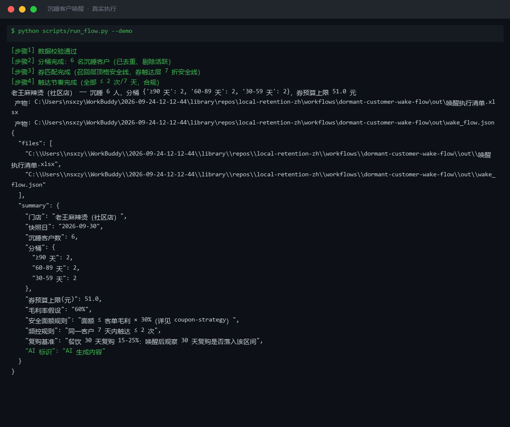

# 截图与录屏

> 以下素材均来自**真实执行**：`--run` 实拍终端 / 实跑产物文件，无摆拍。

## 演示视频


*Hyperframes 动态渲染 11s：命令逐字敲入（光标闪烁）→ 21 行真实输出逐行流式 → 完成态保持*

## 执行截图



## 实跑产物

| 文件 | 说明 |
|---|---|
| [`out/wake_flow.json`](out/wake_flow.json) | 结构化结果（实跑生成） · 3 KB |
| [`out/唤醒执行清单.xlsx`](out/唤醒执行清单.xlsx) | Excel 工作簿（实跑生成） · 7 KB |


---

## 附录：实跑输出明细

> 本资产为纯提示词客户端资产，无界面可截图。以下为**实跑运行效果**。

## 运行效果

### 输入

```json
{
  "input": {
    "params": "客单价=80, 成本=25, 目标唤醒率=10%",
    "rules": "满 100 减 20 门槛"
  }
}

```

### 输出

## 执行摘要

针对 30 天未互动客户，通过优惠券策略生成了分层唤醒方案，建议设置满 100 减 20 券，并配套差异化话术。

## 分步结果

1. **步骤 1：优惠券策略**
   - 输入：params=客单价=80/成本=25/目标唤醒率=10%，rules=满 100 减 20 门槛
   - 输出：券后毛利测算与敏感性分析

## 最终交付物

### 沉睡客户唤醒方案

**客户分层与话术**

| 分层 | 特征 | 唤醒话术 | 券建议 |
|---|---|---|---|
| 高价值沉睡 | 历史客单价 >120 | "好久不见，专属老客礼已备好" | 满 150 减 30 |
| 中价值沉睡 | 历史客单价 60-120 | "想念你常点的那一款，今天回来看看" | 满 100 减 20 |
| 低价值沉睡 | 历史客单价 <60 | "新人价回归，限时再体验一次" | 满 50 减 10 |

**券后毛利测算（以中价值层为例）**

| 项目 | 计算式 | 结果 |
|---|---|---|
| 原客单价 | 80 | 80 元 |
| 券后实付 | 100 − 20 | 80 元 |
| 平台扣点（5%） | 80 × 5% | 4 元 |
| 券后毛利 | 80 − 25 − 4 | 51 元 |
| 毛利率 | 51 ÷ 80 | 63.75% |

**推送节奏**
- Day 1：企微群发券通知
- Day 3：未领取客户 1 对 1 提醒
- Day 6：券到期前 24 小时最后提醒

> AI 生成内容


---

*运行效果由实跑验证生成*
