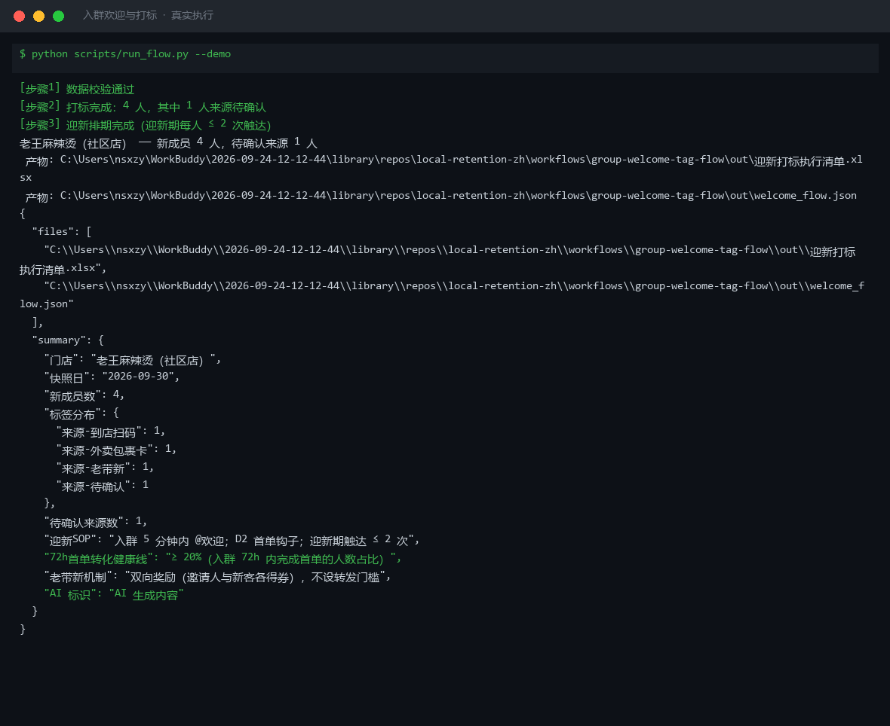
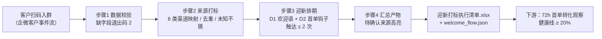

# 入群欢迎与打标 Group Welcome & Tag Flow

> 复合技能（工作流） ｜ 属于「复购管家」 ｜ 本地生活商家客群 ｜ T3 工作流（脚本编排，确定性执行）
>
> **客户扫码入群后 5 分钟内 @欢迎、来源自动打标、72h 首单转化排期——替代人工登记，单客省 3 分钟。**
> 触发：事件（客户扫码入群） ｜ 依赖：[wecom-customer-sync](../) 提供客户事件流
> 频控硬规则：迎新期（D1-D3）同一新客触达 ≤ 2 次 · 72h 首单转化健康线 ≥ 20% · 来源未知打「待确认」不许猜



🎬 **[▶ 观看演示视频（在线播放）](https://cdn.jsdelivr.net/gh/bangwozuo/local-retention-zh@main/workflows/group-welcome-tag-flow/docs/assets/demo.mp4) · [GitHub 页](https://github.com/bangwozuo/local-retention-zh/blob/main/workflows/group-welcome-tag-flow/docs/assets/demo.mp4)** — 四幕检测叙事：业务钩子 → 真实执行 → 检查项逐条亮灯 → 交付物

*上图来自真实执行：5 条入群记录去重后 4 人（重复记录自动剔除），打标分布「到店扫码 / 外卖包裹卡 / 老带新 / 待确认」各 1 人，产物落盘 Excel + JSON。*

---

## 它做什么（四步编排）

| 步骤 | 动作 | 规则 |
|---|---|---|
| 1 数据校验 | 必需字段缺失 → 退出码 2 列清单 | 不编造、不补零 |
| 2 来源打标 | 6 类渠道映射标签：到店扫码 / 外卖包裹卡 / 老带新 / 投放 / 团购核销 | 来源未知 → 「来源-待确认」，不许猜；重复入群记录去重 |
| 3 迎新排期 | D1 欢迎语 + D2 首单钩子 + D3 只观察 | 迎新期每人触达 ≤ 2 次；老带新@邀请人双向奖励 |
| 4 汇总产物 | 迎新打标执行清单.xlsx + welcome_flow.json | 待确认来源在 Excel 中高亮标黄 |

### 打标映射表（真实门店获客渠道口径）

| 来源渠道 | 建议标签 |
|---|---|
| 到店扫码 / 收银台立牌 | 来源-到店扫码 |
| 外卖包裹卡 | 来源-外卖包裹卡 |
| 老带新 | 来源-老带新（双向 15 元券） |
| 朋友圈广告 | 来源-投放 |
| 团购核销 | 来源-团购 |
| 其他/未知 | 来源-待确认（问当班店员后补） |

## 真实输入 → 真实输出

**输入**（`examples/input.json`）：门店 + 今日新成员列表（姓名/来源/入群时间/群）。

**输出**（脚本实跑，节选）：

| 成员 | 来源 | 建议标签 | D1 | D2 | D3 |
|---|---|---|---|---|---|
| 陈晨 | 到店扫码 | 来源-到店扫码 | 5 分钟内 @欢迎 + 公告引导（触达1/2） | 未下单→1v1 首单钩子（触达2/2） | 只观察不触达 |
| 老周 | 老带新 | 来源-老带新 | @老周 欢迎！韩先生推荐的老友，双方的 15 元券已安排 | 未下单→1v1 首单钩子（触达2/2） | 只观察不触达 |
| 小北 | 不知道 | 来源-待确认 | 欢迎进群！怎么找到我们店的呀？（顺带确认来源） | 未下单→1v1 首单钩子（触达2/2） | 只观察不触达 |

完整清单见 [`examples/output.md`](examples/output.md)；产物：`out/迎新打标执行清单.xlsx`（迎新清单 + 标签台账 + 汇总）。

## 处理流水线



## 快速开始

```bash
# 演示模式（内置真实样例）
python scripts/run_flow.py --demo
# 指定输入
python scripts/run_flow.py --input examples/input.json --outdir out
```

提示词方式：欢迎语成文与润色由模型按 prompt.txt 完成（打标与排期为规则计算）。

## 面向谁 / 什么时候用

| ✅ 该用 | ❌ 别用 |
|---|---|
| 每天收口当日新入群成员，批量出迎新清单 | 替代企微官方 API 直接写标签（须店长确认后人工/企微侧执行） |
| 老带新活动的双向奖励核算 | 强行猜测未知来源（打「待确认」问店员） |
| 72h 首单转化健康线监控 | 迎新期超频触达（同一新客 ≤ 2 次，硬规则） |

## 边界与合规

- 本工作流产物为 **AI 生成内容**，欢迎语与打标执行前须经店长/店主确认
- 欢迎语应包含数据用途说明（「用于会员服务与优惠通知」）
- 客户标签仅用于门店私域运营，不二次转卖/共享；群内不透露其他客户信息

## 文件地图

```text
├── README.md            ← 本文件
├── SKILL.md             ← 工作流定义（步骤 / 契约 / 边界）
├── prompt.txt           ← 提示词本体（欢迎语成文与润色）
├── schema.json          ← 输入输出契约（机器可读）
├── scripts/run_flow.py  ← 端到端编排脚本（校验→打标→排期→产物）
├── examples/            ← 真实输入 + 脚本实跑输出
├── docs/                ← 9 项配套文档（架构 / 流程 / 场景 / 测试报告…）
└── out/                 ← 实跑产物（迎新打标执行清单.xlsx / welcome_flow.json）
```

---

*本资产遵循 [bangwozuo 数字员工资产规范](https://github.com/bangwozuo/digital-employee-spec) v3.0 ｜ [所属员工：复购管家](../../) ｜ [总入口](https://github.com/bangwozuo/digital-employees-hub-zh)*
