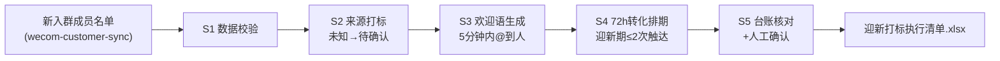

# 入群欢迎与打标

把「新入群成员名单」加工成迎新执行清单：打什么标签、欢迎语怎么说、72 小时内怎么变成首单。

**来源打标与排期由 `scripts/run_flow.py` 计算，模型负责欢迎语成文与偏好引导设计。**

## 能力描述

按「入群 72 小时定去留」的口径编排：数据校验（重复记录去重）→ 来源打标（到店扫码/外卖包裹卡/老带新/投放/团购五类映射，未知来源打「待确认」禁止猜渠道）→ 欢迎语（入群 5 分钟内 @到人，普通/老带新/待确认三路口径，≤ 50 字）→ 72h 转化排期（D1 欢迎语 + D2 首单钩子，迎新期触达 ≤ 2 次，D3 起只观察）→ 台账核对（72h 首单转化对照健康线 ≥ 20%）。老带新必须校验邀请人，双向券不设转发门槛。

## 元信息

| 字段 | 值 |
|------|-----|
| ID | `de_local_03_wf01` |
| 类型 | **`composite`（复合技能 / T3 工作流）** |
| 所属员工 | 复购管家 |
| 阶段 | `P0` |
| 复杂度 | `S` |
| 触发方式 | 事件触发（新成员入群）+ 每日汇总 |
| 资产形态 | 编排提示词 + Python 编排脚本（无模型调用、无 API Key） |

## 编排的原子技能

| # | 原子技能 | 在本流程中的角色 |
|---|---------|------|
| 1 | [企微客户对接](../../skills/wecom-customer-sync/) | 新成员事件数据源；标签写回（人工确认后执行） |
| 2 | [社群 SOP 模板库](../../skills/community-sop-library/) | 群规、首单钩子与迎新基线（72h 首单 ≥ 20%）来源 |
| 3 | [封号合规风控](../../skills/account-ban-risk-control/) | 迎新触达频控与裂变合规把关 |

## 步骤链路（DAG）



## 步骤明细

| # | 步骤 | 执行者 | 输入 | 输出 | 失败处理 |
|---|------|---------|------|------|---------|
| 1 | 数据校验 | 脚本 | 新成员列表 | 合格数据集 | 缺字段退出码 2；重复记录去重 |
| 2 | 来源打标 | 脚本 | 合格数据集 | 来源标签 | 来源未知 → 「待确认」，禁止猜渠道 |
| 3 | 欢迎语生成 | 模型 | 带标签名单 | 三路口径欢迎语 | 超时漏欢迎 → 补发并致歉 |
| 4 | 72h 转化排期 | 脚本 | 带标签名单 | D1/D2/D3 计划 | D2 已下单改发跟进；退群记录台账 |
| 5 | 台账核对 | 人工 | 标签台账 + 转化率 | 确认后的写回 | 待确认项问当班店员；数据脏先修数 |

## 输入规格

| 字段 | 类型 | 必填 | 说明 |
|------|------|------|------|
| `shop` | string | ✅ | 门店名 |
| `today` | string | ⬜ | 快照日（缺省取当天） |
| `new_members` | array | ✅ | [{name, source, added_at, group, inviter?}]，source 为获客渠道口径 |

## 输出规格

| 字段 | 类型 | 说明 |
|------|------|------|
| `summary` | object | 新成员数 / 标签分布 / 待确认来源数 / 迎新 SOP 与健康线 |
| `items` | array | 迎新清单（成员/来源/建议标签/邀请人/欢迎语要点/D1/D2/D3） |
| 产物 | 文件 | `out/迎新打标执行清单.xlsx`（待确认标红）、`out/welcome_flow.json` |

## 验收标准

- [ ] 每一步的技能资产齐全（SKILL.md / prompt.txt / schema.json）
- [ ] 步骤间输入输出字段可衔接（名单 → 标签 → 欢迎语 → 排期）
- [ ] 迎新期触达 ≤ 2 次/人；来源无猜测项
- [ ] 末步输出带 AI 生成标识，标签写回经人工确认

## 使用步骤

### 方式一：带脚本（推荐，端到端）

```bash
python3 <WF_DIR>/scripts/run_flow.py --input input.json --outdir out
python3 <WF_DIR>/scripts/run_flow.py --demo
```

### 方式二：纯对话编排

把 `prompt.txt` 全文粘贴为系统提示词 → 提供新入群名单 → 按 DAG 逐步执行，末步产出迎新清单。

### 平台编排

| 平台 | 编排方式 |
|------|---------|
| **Coze / 扣子** | 新建工作流 → 按步骤添加节点 |
| **Dify** | Workflow → LLM 节点链 + 代码节点（打标逻辑） |
| **WorkBuddy** | 新建 Skill 按步骤串联各技能提示词 |

## 边界（不做的事）

- ❌ 不猜来源——未知打「待确认」，错误标签比没有标签更糟
- ❌ 不超 2 次迎新触达——欢迎语 + 1 次首单钩子后只观察，新客最怕热情过火
- ❌ 不设转发门槛——老带新只用「双方各得券」双向奖励
- ❌ 不群发欢迎——欢迎必须 @到人；不发糊涂奖励（老带新缺邀请人时双向券暂缓）
- ❌ 偏好问卷 ≤ 3 题、奖励 ≤ 5 元券，不收集手机号等敏感信息

## 调用示例

**输入**（`examples/input.json`）：青禾轻食 9-29 当日 5 名新成员（含 1 名来源未知、1 名老带新）。

**输出**（脚本实跑，退出码 0）：

| 成员 | 来源 | 建议标签 | 邀请人 | 欢迎语要点 |
|---|---|---|---|---|
| 老周 | 老带新 | 来源-老带新 | 韩先生 | 「韩先生推荐的老友，双方 15 元券已安排」 |
| Yuki | 团购核销 | 来源-团购 | - | 欢迎进群 + 公告首单券入口 |
| 小北 | 不知道 | 来源-待确认 | - | 欢迎进群 + 顺带问来源 |
| 陈晨 | 到店扫码 | 来源-到店扫码 | - | 欢迎进群 + 公告首单券入口 |
| Momo | 外卖包裹卡 | 来源-外卖包裹卡 | - | 欢迎进群 + 公告首单券入口 |

标签分布：五类各 1 人；迎新期每人触达 ≤ 2 次（D1 欢迎语 + D2 首单钩子）。

## 所属工作流

本资产为复合技能（工作流），是独立的端到端流程，不隶属于其他工作流。

## 合规声明

- 本技能输出为 **AI 辅助生成内容**，标签写回与欢迎语发布前必须经人工确认
- 偏好收集前告知用途，不收集敏感信息；客户要求删除时 3 个工作日内处理
- 老带新奖励台账可对账，公示脱敏；触达频控遵守微信平台规则

---

*本复合技能遵循 [bangwozuo 数字员工资产规范](https://github.com/bangwozuo/digital-employee-spec) v3.0*
