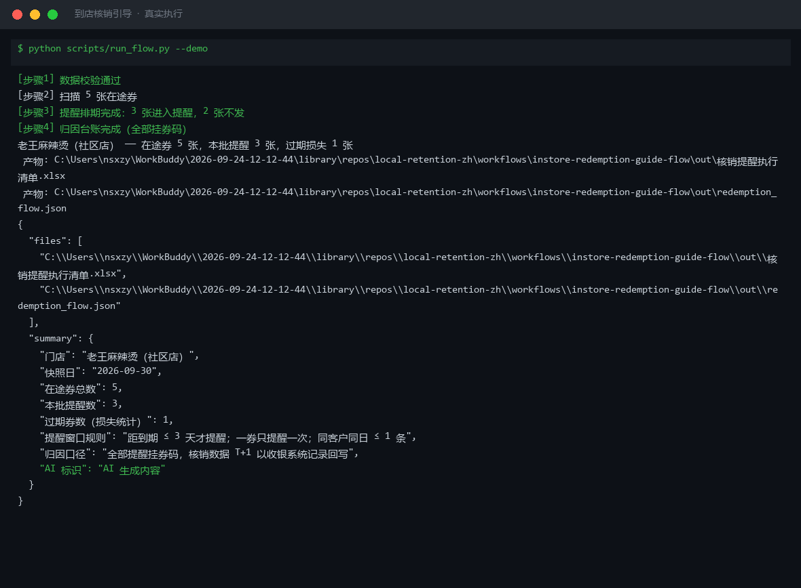

# 到店核销引导 In-Store Redemption Guide Flow

> 复合技能（工作流） ｜ 属于「复购管家」 ｜ 本地生活商家客群 ｜ T3 工作流（脚本编排，确定性执行）
>
> **领券后没到店的客户，在券到期前 3 天内按 D-3 预告 / D-1 紧迫 / 当天截止三档提醒——一券只提醒一次，提升券核销率，直接换算营收。**
> 触发：事件（领券后 48h 未到店） ｜ 依赖：[coupon-strategy](../../skills/coupon-strategy/) 券方案 + [wecom-customer-sync](../../skills/wecom-customer-sync/) 触达回写
> 硬规则：距到期 ≤ 3 天才提醒 · 一券只提醒一次 · 同客户同日 ≤ 1 条 · 全部提醒挂券码归因




*上图来自真实执行（青禾轻食样例）：6 张在途券扫描后 4 张进入提醒（当天 1 / D-1 紧迫 1 / D-3 预告 2），过期损失 1 张进损失统计，重复券码自动去重，产物落盘执行清单 Excel + JSON。*

---

## 它做什么（四步编排）

| 步骤 | 动作 | 规则 |
|---|---|---|
| 1 数据校验 | 在途券列表 + 快照日必需 | 缺失 → 退出码 2；expire 无法解析即失败 |
| 2 到期扫描 | 逐券计算距到期天数 | 券码重复去重并标注 |
| 3 提醒排期 | 按窗口分档：D-3 预告 / D-1 紧迫 / 当天截止 | 过期券与已提醒券不再触达；距到期 > 3 天未到窗口 |
| 4 归因台账 | 每条提醒挂券码 | 核销确认 T+1 以收银系统券码记录回写，不从企微侧猜测 |

### 提醒窗口分档话术方向

| 距到期 | 动作 | 话术方向 |
|---|---|---|
| 0 天（当天） | 当天提醒 | 截止口径：今日最后一天，报券码+有效期至今晚 |
| 1 天 | D-1 紧迫提醒 | 明天到期：报券码+面额+到店指引 |
| 2-3 天 | D-3 预告 | 轻预告：顺带本周新品/招牌，不做紧迫话术 |
| > 3 天 / 已提醒 / 已过期 | 不提醒 | 太早打扰、太晚来不及；一券只提醒一次 |

## 真实输入 → 真实输出

**输入**（`examples/input.json`）：门店 + 快照日 + 在途券列表（客户/券码/面额/门槛/到期日/是否已提醒）。

**输出**（脚本实跑，节选）：

| 客户 | 券码 | 面额 | 到期日 | 距到期 | 动作 | 话术方向 |
|---|---|---|---|---|---|---|
| 吴迪 | QH0929-017 | 6 元 | 2026-09-29 | 0 | 当天提醒 | 截止口径：今日最后一天，报券码+有效期至今晚 |
| 韩先生 | QH0929-014 | 5 元 | 2026-09-30 | 1 | D-1 紧迫提醒 | 明天到期：报券码+面额+到店指引 |
| 周小姐 | QH0929-011 | 5 元 | 2026-10-02 | 3 | D-3 预告 | 轻预告：顺带本周新品/招牌 |
| 甜甜 | QH0929-021 | 5 元 | 2026-09-27 | -2 | 不提醒 | 已过期，进损失统计 |
| 老许 | QH0929-024 | 10 元 | 2026-10-08 | 9 | 不提醒 | 距到期 > 3 天，未到提醒窗口 |

汇总：在途券 6 张，本批提醒 4 张，过期损失 1 张。完整清单见 [`examples/output.md`](examples/output.md)；产物：`out/核销提醒执行清单.xlsx`（不提醒行自动标灰）。

## 处理流水线


## 快速开始

```bash
# 演示模式（内置真实样例）
python scripts/run_flow.py --demo
# 指定输入
python scripts/run_flow.py --input examples/input.json --outdir out
```

提示词方式：提醒话术成文由模型按 prompt.txt 生成（到期扫描与排期为规则计算）。

## 面向谁 / 什么时候用

| ✅ 该用 | ❌ 别用 |
|---|---|
| 每天收口临期券，出当日提醒清单 | 对同一张券反复轰炸（一券只提醒一次） |
| 过期未核销的损失统计与复盘 | 把未到窗口的券提前提醒（太早即打扰） |
| 核销率提升效果按券码归因核算 | 按「到店就算券带来」粗算归因（只认券码记录） |

## 边界与合规

- 本工作流产物为 **AI 生成内容**，提醒名单执行前须经店主确认（多写一条就是骚扰一条）
- 频控：同一客户同一天只发 1 条提醒；不使用非官方工具群发
- 核销数据以收银系统券码记录为准；客户标识脱敏输出（手机号只留后 4 位）

## 文件地图

```text
├── README.md            ← 本文件
├── SKILL.md             ← 工作流定义（步骤 / 契约 / 边界）
├── prompt.txt           ← 提示词本体（提醒话术成文）
├── schema.json          ← 输入输出契约（机器可读）
├── scripts/run_flow.py  ← 端到端编排脚本（校验→扫描→排期→归因→产物）
├── examples/            ← 真实输入 + 脚本实跑输出
├── docs/                ← 9 项配套文档（架构 / 流程 / 场景 / 测试报告…）
└── out/                 ← 实跑产物（核销提醒执行清单.xlsx / redemption_flow.json）
```

---

*本资产遵循 [bangwozuo 数字员工资产规范](https://github.com/bangwozuo/digital-employee-spec) v3.0 ｜ [所属员工：复购管家](../../) ｜ [总入口](https://github.com/bangwozuo/digital-employees-hub-zh)*
